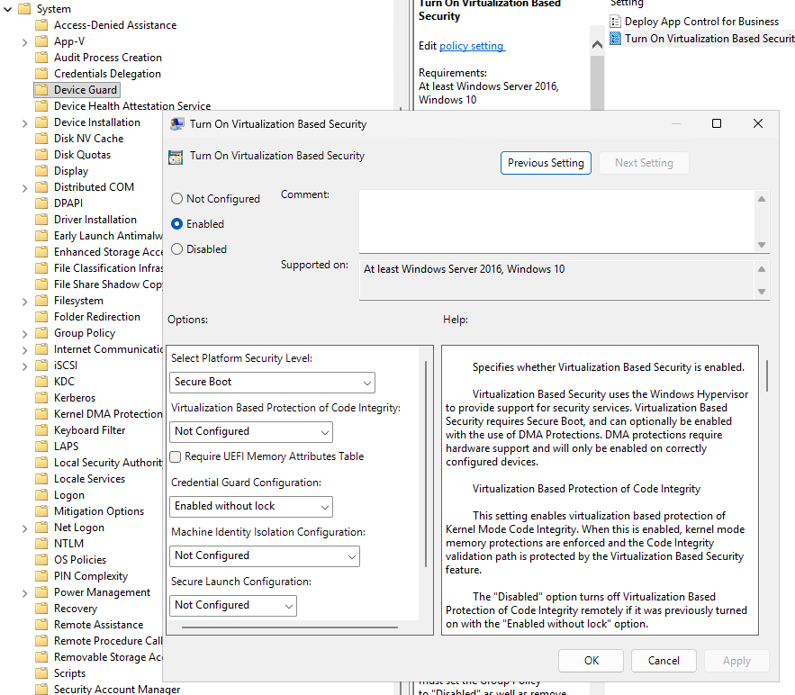
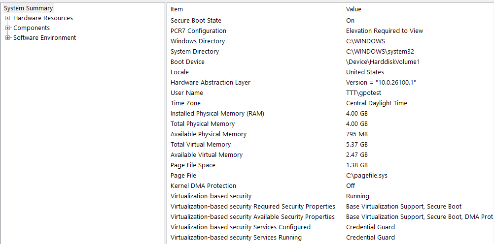
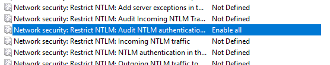
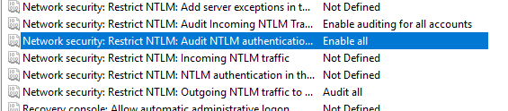
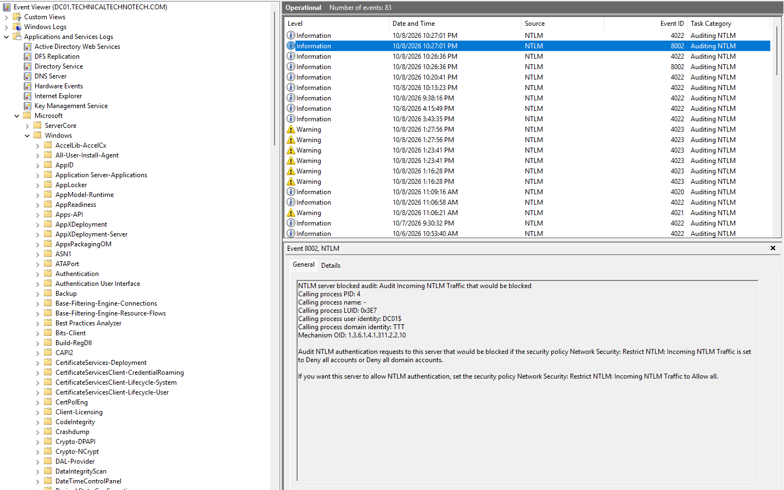
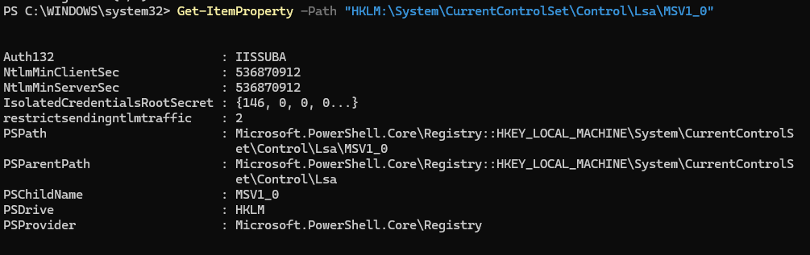
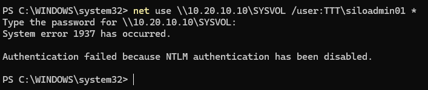

# Credential Guard and NTLM Auditing & Blocking

## Project Overview

This project focuses on strengthening Windows authentication security through Microsoft Defender Credential Guard, NTLM auditing, and NTLM blocking.

Using an existing Active Directory Domain Services (AD DS) environment, I configured security policies through Group Policy, monitored NTLM authentication activity using Event Viewer, and tested authentication restrictions.

The objective was to understand how Windows protects credentials, how administrators identify legacy authentication protocols, and how NTLM restrictions affect domain authentication.

---

## Lab Environment

| Component | Configuration |
|---|---|
| Domain | technicaltechnotech.com |
| NetBIOS Name | TTT |
| DC01 | Windows Server Domain Controller |
| DC02 | Windows Server Core Domain Controller |
| MGMT01 | Windows 11 Management Workstation |
| CLIENT01 | Windows 11 Domain-Joined Workstation |
| Virtualization | Hyper-V |
| Management Tools | Group Policy Management, PowerShell, Event Viewer |
| Authentication Protocols | Kerberos, NTLM |

---

# Microsoft Defender Credential Guard

## Objective

Configure Microsoft Defender Credential Guard through Group Policy and verify that virtualization-based security (VBS) protects supported authentication credentials.

## Implementation

### Step 1 – Check Credential Guard Status

On CLIENT01, I used PowerShell to inspect the current Device Guard configuration.

```powershell
Get-CimInstance -ClassName Win32_DeviceGuard `
    -Namespace root\Microsoft\Windows\DeviceGuard |
    Select-Object VirtualizationBasedSecurityStatus,
                  SecurityServicesConfigured,
                  SecurityServicesRunning
```

### Initial Results

| Property | Value |
|---|---|
| VirtualizationBasedSecurityStatus | 2 |
| SecurityServicesConfigured | 0 |
| SecurityServicesRunning | 1 |

These results indicated that VBS was running and Credential Guard was reported as active, although it was not explicitly listed as configured.

I also verified the status using System Information (`msinfo32`).

### Step 2 – Configure Credential Guard Using Group Policy

On MGMT01, I opened Group Policy Management and created:

**GPO:** `GPO-Lab - Credential Guard`

The GPO was linked to the Workstations OU containing CLIENT01.

Configuration path:

`Computer Configuration > Policies > Administrative Templates > System > Device Guard`

Configured the following policy:



The **Enabled without lock** option was selected to simplify future configuration changes in the lab.

### Step 3 – Apply Group Policy

On CLIENT01:

```powershell
gpupdate /force
```

Restarted the workstation:

```powershell
Restart-Computer
```

### Step 4 – Verify Credential Guard

Opened System Information:

```powershell
msinfo32
```

### Validation Results



## Result

**Successful**

Credential Guard was configured through Group Policy and verified as running on CLIENT01.

This demonstrated centralized management of virtualization-based credential protection.

---

# Project 2 – NTLM Authentication Auditing

## Objective

Configure NTLM auditing on Domain Controllers to identify NTLM authentication activity before implementing restrictions.

NTLM is a legacy Windows authentication protocol. Auditing helps administrators identify systems and applications that may depend on it.

## Implementation

### Step 1 – Create an NTLM Auditing GPO

On MGMT01, I created:

**GPO:** `GPO-Lab - NTLM Auditing`

Linked the GPO to the **Domain Controllers OU**.

Configuration path:

`Computer Configuration > Policies > Windows Settings > Security Settings > Local Policies > Security Options`

Configured:



This allows domain-level NTLM authentication activity to be audited without blocking it.

Additional incoming and outgoing NTLM audit settings were enabled during troubleshooting.

### Step 2 – Verify Group Policy Application

Used the **Group Policy Results Wizard** from MGMT01 to inspect DC01 and DC02.

Verified that:

- The NTLM auditing GPO applied to DC01.
- The NTLM auditing GPO applied to DC02.
- The configured security settings appeared in the Group Policy results.

### Step 3 – Configure Remote Event Log Management

Initially, Event Viewer could not remotely connect to DC01 because the required firewall access was unavailable.

I enabled the Remote Event Log Management firewall rules using PowerShell Remoting.

```powershell
Invoke-Command -ComputerName DC01 -ScriptBlock {
    Enable-NetFirewallRule -DisplayGroup "Remote Event Log Management"
}
```

After applying the firewall rules, MGMT01 successfully connected to DC01 through Event Viewer.

### Step 4 – Inspect NTLM Authentication Events

On MGMT01, I opened Event Viewer and connected to DC01.

Navigated to:

`Applications and Services Logs > Microsoft > Windows > NTLM > Operational`

Initially, the expected domain-level NTLM audit event (Event ID 8004) was not observed.

After enabling additional NTLM auditing settings: 



and repeating authentication tests, I successfully recorded **Event ID 8002**.

### Event ID 8002

The event reported:



This indicated that DC01 recorded incoming NTLM authentication activity that would be affected by an enforced incoming NTLM restriction.

The event was generated in audit mode rather than proving that authentication was blocked.

### Validation Results

| Test | Result |
|---|---|
| NTLM auditing GPO applied to DC01 | Passed |
| NTLM auditing GPO applied to DC02 | Passed |
| Remote Event Viewer connection | Passed |
| NTLM Operational log accessible | Passed |
| Event ID 8002 recorded | Passed |
| Event ID 8004 observed | Not verified |

## Result

**Successful – Incoming NTLM Auditing**

NTLM auditing was configured and verified through Event ID 8002.

Domain-level Event ID 8004 was not confirmed during this exercise.

---

# Project 3 – NTLM Authentication Blocking

## Objective

Configure a controlled NTLM restriction on a Windows 11 workstation, verify that NTLM authentication is denied, and confirm that normal domain resource access remains functional.

To avoid disrupting Active Directory services, NTLM blocking was tested on CLIENT01 rather than enforced across the domain.

## Implementation

### Step 1 – Create an NTLM Blocking GPO

Created:

**GPO:** `GPO-Lab - NTLM Blocking Test`

The GPO was scoped to CLIENT01.

Configuration path:

`Computer Configuration > Policies > Windows Settings > Security Settings > Local Policies > Security Options`

Configured:

**Network security: Restrict NTLM: Outgoing NTLM traffic to remote servers**

Setting:

`Deny all`

### Step 2 – Apply Group Policy

On CLIENT01:

```powershell
gpupdate /force
```

### Step 3 – Verify NTLM Blocking Configuration

Used PowerShell to inspect the effective registry setting.

```powershell
Get-ItemPropertyValue `
    -Path "HKLM:\SYSTEM\CurrentControlSet\Control\Lsa\MSV1_0" `
    -Name RestrictSendingNTLMTraffic
```



### Registry Values

| Value | Meaning |
|---|---|
| 0 | Allow all |
| 1 | Audit all |
| 2 | Deny all |

**Observed value:** `2`

This confirmed that outgoing NTLM blocking was configured on CLIENT01.

### Step 4 – Test NTLM Authentication

Attempted to access DC01's SYSVOL share using its IP address and a regular domain test account.

```cmd
net use \\10.20.10.10\SYSVOL /user:TTT\TestUser *
```

`TestUser` represents a regular test account rather than the literal account name used in the lab.

The authentication attempt failed.

### Observed Result



This confirmed that the outgoing NTLM restriction was actively preventing the attempted authentication.

### Step 5 – Verify Domain Resource Access

To verify that normal domain access remained functional, I tested SYSVOL using the domain name.

```powershell
Test-Path "\\technicaltechnotech.com\SYSVOL"
```

**Result:** `True`

I also inspected Kerberos tickets:

```powershell
klist
```

Kerberos ticket information was present.

These results confirmed that domain resource access remained functional while outgoing NTLM was blocked.

### Step 6 – Restore Original NTLM Configuration

After completing the test, I changed the GPO setting from:

`Deny all`

To:

`Allow all`

Applied the updated policy:

```powershell
gpupdate /force
```

Verified the effective registry value:

```powershell
Get-ItemPropertyValue `
    -Path "HKLM:\SYSTEM\CurrentControlSet\Control\Lsa\MSV1_0" `
    -Name RestrictSendingNTLMTraffic
```

**Final value:** `0`

The workstation was returned to its original outgoing NTLM configuration.

## Result

**Successful**

Confirmed that outgoing NTLM authentication could be blocked on CLIENT01 without preventing normal domain-based SYSVOL access.

The restriction was removed after testing.

---

# Troubleshooting Experience

## Issue 1 – Remote Event Viewer Connection Failed

**Problem:**

MGMT01 could not remotely connect to DC01's Event Viewer.

**Investigation:**

The error indicated that remote event log access might be blocked by Windows Defender Firewall.

**Resolution:**

Enabled the Remote Event Log Management firewall rule group using PowerShell Remoting.

**Result:**

Remote Event Viewer access succeeded.

---

## Issue 2 – NTLM Audit Event Not Appearing

**Problem:**

NTLM authentication tests initially failed to generate the expected Event ID 8004.

**Investigation:**

- Verified NTLM auditing GPO application.
- Checked the NTLM Operational event log.
- Tested SMB connectivity.
- Verified SYSVOL access through the domain name.
- Reviewed NTLM authentication restrictions.

**Resolution:**

Enabled additional incoming and outgoing NTLM auditing settings and repeated authentication tests.

**Result:**

Successfully recorded Event ID 8002, validating incoming NTLM auditing.

Event ID 8004 was not confirmed.

---

## Issue 3 – NTLM Authentication Failed

**Problem:**

An IP-based SMB authentication attempt failed after enabling outgoing NTLM blocking.

**Investigation:**

Verified the outgoing NTLM restriction was configured as `Deny all`.

**Result:**

Windows explicitly reported that NTLM authentication had been disabled.

This was the expected security behavior.

---

# Security Concepts Demonstrated

## Virtualization-Based Security (VBS)

Uses hardware virtualization capabilities to isolate security-sensitive components from the normal Windows operating system.

## Microsoft Defender Credential Guard

Protects supported authentication secrets using VBS isolation to reduce the risk of credential theft.

## NTLM Authentication

A legacy challenge-response authentication protocol still used by some Windows applications and services.

## Kerberos Authentication

The preferred authentication protocol for Active Directory environments, supporting ticket-based authentication.

## NTLM Auditing

Records NTLM authentication activity to help administrators identify dependencies before enforcing restrictions.

## NTLM Blocking

Restricts NTLM authentication to reduce exposure to credential-based attacks.

## Group Policy

Provides centralized management of Windows security settings across domain-joined computers.

---

# What I Learned

- How Microsoft Defender Credential Guard protects supported authentication credentials.
- How to configure Credential Guard through Group Policy.
- How to verify virtualization-based security using PowerShell and System Information.
- How to configure NTLM auditing on Domain Controllers.
- How to investigate NTLM authentication activity using Event Viewer.
- How to enable remote Event Log Management through Windows Defender Firewall.
- How to identify incoming NTLM auditing events.
- How to configure outgoing NTLM restrictions on a workstation.
- How to verify NTLM blocking through authentication testing.
- How to confirm that domain resource access remains functional.
- Why authentication restrictions should be tested before broad deployment.
- How to restore security configurations after controlled testing.

---

# Skills Practiced

- Windows Server Administration
- Active Directory Domain Services (AD DS)
- Microsoft Defender Credential Guard
- Virtualization-Based Security (VBS)
- Group Policy Management
- Windows Defender Firewall
- PowerShell Administration
- PowerShell Remoting
- Remote Event Log Management
- Windows Event Viewer
- NTLM Authentication
- Kerberos Authentication
- Identity and Access Management (IAM)
- Windows Security Hardening
- Authentication Auditing
- Security Policy Enforcement
- SMB Connectivity Troubleshooting
- Domain Authentication Troubleshooting
- Security Configuration Validation
- Change Management and Rollback
