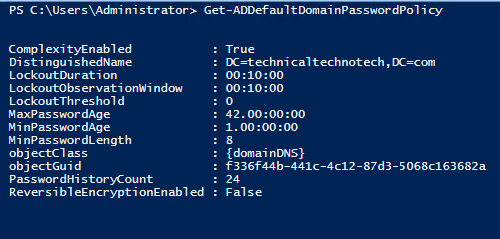
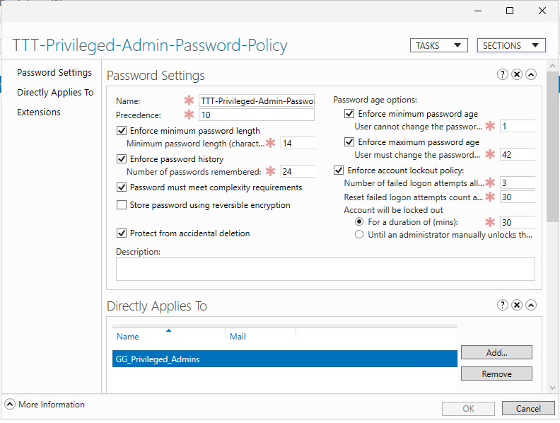
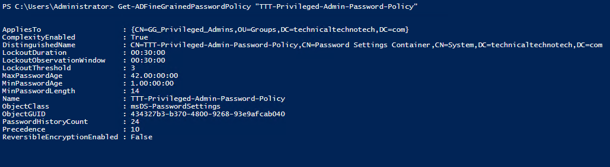
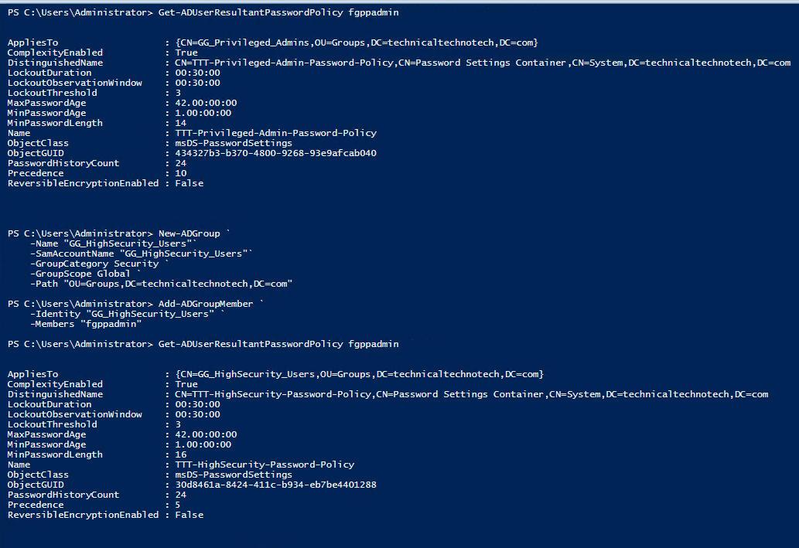
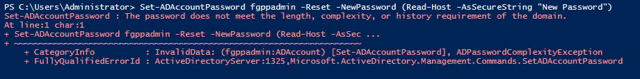

# Domain Password Policy & Fine-Grained Password Policy

## Project Overview

This project focused on configuring, comparing, and testing password policies in an Active Directory Domain Services environment.

The project demonstrated two different methods of controlling domain user password requirements:

1. **Default Domain Password Policy**
2. **Fine-Grained Password Policies (FGPP)**

The lab also demonstrated how Active Directory determines which password policy applies when a user is affected by multiple Fine-Grained Password Policies.

The project concluded by testing actual password enforcement against the resultant password policy.

***

# Lab Environment

| System | Role |
|---|---|
| DC01 | Windows Server GUI Domain Controller / PDC Emulator |
| DC02 | Windows Server Core Domain Controller |
| MGMT01 | Windows 11 Management Workstation |
| CLIENT01 | Windows 11 Domain Client |
| Domain | `technicaltechnotech.com` |
| NetBIOS | `TTT` |

Administration was primarily performed from **MGMT01** using:

- Active Directory Administrative Center (ADAC)
- Active Directory PowerShell module
- Group Policy Management Console (GPMC)
- RSAT

***

# Project Objectives

The objectives of this project were to:

- Review the domain's default password policy
- Understand domain-wide password requirements
- Create a Fine-Grained Password Policy
- Apply an FGPP to a Global Security Group
- Verify a user's resultant password policy
- Create competing FGPPs
- Test FGPP precedence
- Compare domain password policy with FGPP
- Test actual password enforcement

***

# Domain Password Policy

## Reviewing the Existing Domain Policy

The current domain password policy was inspected from MGMT01 using:

```powershell
Get-ADDefaultDomainPasswordPolicy
```

This displayed settings including:



The environment was primarily using the default domain settings, with the previously adjusted minimum password length:

```text
Minimum Password Length: 8
```

***

# Default Domain Password Policy

The default domain password policy establishes the normal password and account-lockout requirements for domain accounts.

Conceptually:

```text
technicaltechnotech.com
        ↓
Default Domain Password Policy
        ↓
Normal Domain Accounts
```

Important password-related settings include:

| Setting | Purpose |
|---|---|
| Password History | Prevents immediate reuse of previous passwords |
| Minimum Password Age | Controls how soon a password can be changed again |
| Maximum Password Age | Controls password expiration |
| Minimum Password Length | Requires a minimum number of characters |
| Complexity | Requires passwords to meet complexity requirements |
| Reversible Encryption | Determines whether passwords can be stored using reversible encryption |

Account lockout settings include:

| Setting | Purpose |
|---|---|
| Lockout Threshold | Number of failed attempts before lockout |
| Lockout Duration | How long the account remains locked |
| Observation Window | When the failed-attempt counter resets |

***

# Domain Policy vs Fine-Grained Password Policy

The domain password policy provides the default requirements.

Fine-Grained Password Policies allow selected users to receive different password and account-lockout requirements.

```text
Default Domain Password Policy
             ↓
       Normal Users


Fine-Grained Password Policy
             ↓
      Selected Users
```

This allows organizations to implement stronger password requirements for accounts such as:

- Administrators
- Privileged users
- Service-related accounts
- High-security users

without creating another Active Directory domain.

***

# Fine-Grained Password Policy

## Scenario

Technical Techno Tech wanted stronger password requirements for privileged administrator accounts.

A Global Security Group was created:

```text
GG_Privileged_Admins
```

A dedicated test account was also created:

```text
fgppadmin
```

Using a test account prevented the lab from interfering with the actual domain Administrator account.

***

# Creating the Privileged Administrators Group

The group was created using PowerShell:

```powershell
New-ADGroup `
    -Name "GG_Privileged_Admins" `
    -SamAccountName "GG_Privileged_Admins" `
    -GroupCategory Security `
    -GroupScope Global `
    -Path "OU=Groups,DC=technicaltechnotech,DC=com"
```

The test administrator was added:

```powershell
Add-ADGroupMember `
    -Identity "GG_Privileged_Admins" `
    -Members "fgppadmin"
```

Membership was verified:

```powershell
Get-ADGroupMember "GG_Privileged_Admins"
```

The resulting structure was:

```text
GG_Privileged_Admins
        ↓
    fgppadmin
```

***

# Password Settings Container

Fine-Grained Password Policies are stored as **Password Settings Objects (PSOs)** in Active Directory.

Using Active Directory Administrative Center:

```text
technicaltechnotech (local)
└── System
    └── Password Settings Container
```

A new Password Settings Object was created:

```text
TTT-Privileged-Admin-Password-Policy
```

***

# Privileged Administrator Password Policy

The lab policy was configured with stronger requirements than the normal domain policy.



The PSO was configured to directly apply to:

```text
GG_Privileged_Admins
```

The resulting structure was:

```text
TTT-Privileged-Admin-Password-Policy
               ↓
      GG_Privileged_Admins
               ↓
           fgppadmin
```

***

# Fine-Grained Password Policy Scoping

One of the major differences between traditional Group Policy and Fine-Grained Password Policy is how the policy is targeted.

A normal GPO can be linked to Active Directory containers such as domains and OUs:

```text
GPO
 ↓
OU
 ↓
Users / Computers
```

A Fine-Grained Password Policy works differently:

```text
Password Settings Object
          ↓
User or Global Security Group
          ↓
Domain User
```

Fine-Grained Password Policies are **not linked to OUs like normal GPOs**.

***

# Verifying the Fine-Grained Password Policy

The newly created PSO was inspected using:

```powershell
Get-ADFineGrainedPasswordPolicy `
    -Identity "TTT-Privileged-Admin-Password-Policy"
```



The policy actually affecting the test user was then checked:

```powershell
Get-ADUserResultantPasswordPolicy fgppadmin
```

The resultant policy returned:

```text
TTT-Privileged-Admin-Password-Policy
```

This confirmed that `fgppadmin` was receiving the Fine-Grained Password Policy through membership in:

```text
GG_Privileged_Admins
```

***

# Resultant Password Policy

The **resultant password policy** answers an important administrative question:

> Which Fine-Grained Password Policy is actually effective for this user?

The command:

```powershell
Get-ADUserResultantPasswordPolicy fgppadmin
```

can be used to determine the effective PSO.

This becomes particularly important when a user qualifies for multiple Fine-Grained Password Policies.

***

# Fine-Grained Password Policy Precedence

## Creating a Policy Conflict

The next checkpoint intentionally placed `fgppadmin` under two different Fine-Grained Password Policies.

A second Global Security Group was created:

```text
GG_HighSecurity_Users
```

The existing test user was added:

```powershell
Add-ADGroupMember `
    -Identity "GG_HighSecurity_Users" `
    -Members "fgppadmin"
```

The user now belonged to:

```text
fgppadmin
   │
   ├── GG_Privileged_Admins
   │
   └── GG_HighSecurity_Users
```

***

# Creating the High-Security PSO

A second Password Settings Object was created:

```text
TTT-HighSecurity-Password-Policy
```

Example settings included:

| Setting | Value |
|---|---:|
| Precedence | 5 |
| Minimum Password Length | 16 |
| Password History | 24 |
| Complexity | Enabled |
| Lockout Threshold | 3 |

The policy was assigned to:

```text
GG_HighSecurity_Users
```

***

# Competing Password Policies

The test user now qualified for two Fine-Grained Password Policies:

```text
                    fgppadmin
                    /       \
                   /         \
GG_Privileged_Admins      GG_HighSecurity_Users
        ↓                         ↓
Privileged Admin PSO       High Security PSO
Precedence: 10             Precedence: 5
Min Length: 14             Min Length: 16
```

This created an intentional policy conflict.

***

# FGPP Precedence

Fine-Grained Password Policies use a precedence value to determine which policy wins when multiple PSOs are applicable.

The important rule is:

> **Lower precedence number = higher priority.**

Therefore:

```text
Precedence 5
     ↓
beats
     ↓
Precedence 10
```

The expected effective policy was therefore:

```text
TTT-HighSecurity-Password-Policy
```

with:

```text
Minimum Password Length: 16
```

***

# Verifying the Winning Policy

Instead of assuming which policy won, Active Directory was queried directly:

```powershell
Get-ADUserResultantPasswordPolicy fgppadmin
```

The resultant policy confirmed:

```text
TTT-HighSecurity-Password-Policy
```

with the higher-priority precedence value:

```text
Precedence: 5
```

All Fine-Grained Password Policies could also be compared using:

```powershell
Get-ADFineGrainedPasswordPolicy -Filter * |
    Select-Object Name,Precedence,MinPasswordLength,LockoutThreshold
```

This provided a quick administrative view of the PSOs configured in the domain.

Initially the winning policy was of Privileged Admins, but after everything, it is now of High Security Users. Observe the screenshot.



***

# Password Policy Decision Process

The lab demonstrated the following general process:

```text
Domain User
    ↓
Does an applicable FGPP exist?
    │
    ├── No
    │    ↓
    │  Domain Password Policy
    │
    └── Yes
         ↓
    Applicable PSO(s)
         ↓
    Determine Precedence
         ↓
    Resultant Password Policy
```

For the test account:

```text
fgppadmin
    ↓
Multiple FGPPs apply
    ↓
Precedence 5 beats Precedence 10
    ↓
TTT-HighSecurity-Password-Policy
    ↓
Minimum Password Length: 16
```

***

# Testing Password Enforcement

The final checkpoint verified that the resultant password policy was actually enforced.

The effective policy was first confirmed:

```powershell
Get-ADUserResultantPasswordPolicy fgppadmin |
    Select-Object Name,Precedence,MinPasswordLength,ComplexityEnabled
```

The expected effective policy was:

```text
Name              : TTT-HighSecurity-Password-Policy
Precedence        : 5
MinPasswordLength : 16
ComplexityEnabled : True
```

***

# Testing a Non-Compliant Password

The password for the test account was reset using:

```powershell
Set-ADAccountPassword fgppadmin -Reset `
    -NewPassword (Read-Host -AsSecureString "New Password")
```

A password shorter than the required minimum length was tested.

Because the resultant PSO required:

```text
Minimum Password Length: 16
```

a password that failed the configured requirements was rejected by Active Directory.



This demonstrated that the PSO was not simply an administrative configuration displayed in ADAC—the password requirements were actually enforced by Active Directory.

***

# Testing a Compliant Password

The password reset was attempted again using a password meeting the configured requirements.

The password satisfied:

```text
16+ characters
+
Complexity requirements
```

The compliant password was accepted.

The complete test demonstrated:

```text
fgppadmin
    ↓
High Security PSO
    ↓
Precedence 5
    ↓
Minimum Length 16
    ↓
Non-Compliant Password
    ↓
REJECTED

        vs.

Compliant Password
    ↓
ACCEPTED
```

***

# Domain Policy vs Fine-Grained Password Policy

| Feature | Domain Password Policy | Fine-Grained Password Policy |
|---|---|---|
| Purpose | Default domain account policy | Different requirements for selected users |
| Scope | Domain accounts by default | Specific users/groups |
| Stored As | Domain password/account policy | Password Settings Object |
| OU Link | No special OU-specific password policy behavior | Not linked to OU |
| Multiple Policies | Domain default | Multiple PSOs possible |
| Precedence | Not used like FGPP | Lower number has higher priority |
| PowerShell Verification | `Get-ADDefaultDomainPasswordPolicy` | `Get-ADUserResultantPasswordPolicy` |

***

# Useful PowerShell Commands

## View Default Domain Password Policy

```powershell
Get-ADDefaultDomainPasswordPolicy
```

## View All Fine-Grained Password Policies

```powershell
Get-ADFineGrainedPasswordPolicy -Filter *
```

## View a Specific PSO

```powershell
Get-ADFineGrainedPasswordPolicy `
    -Identity "TTT-Privileged-Admin-Password-Policy"
```

## Determine a User's Resultant FGPP

```powershell
Get-ADUserResultantPasswordPolicy fgppadmin
```

## Compare PSOs

```powershell
Get-ADFineGrainedPasswordPolicy -Filter * |
    Select-Object Name,Precedence,MinPasswordLength,LockoutThreshold
```

## View Group Membership

```powershell
Get-ADGroupMember "GG_Privileged_Admins"
```

## Reset a Test Password

```powershell
Set-ADAccountPassword fgppadmin -Reset `
    -NewPassword (Read-Host -AsSecureString "New Password")
```

***

# Troubleshooting Workflow

When investigating unexpected password-policy behavior:

```text
User reports password issue
        ↓
Check Default Domain Policy
        ↓
Get-ADDefaultDomainPasswordPolicy
        ↓
Does user have an FGPP?
        ↓
Get-ADUserResultantPasswordPolicy
        ↓
Check PSO settings
        ↓
Check group membership
        ↓
Check PSO precedence
        ↓
Test password requirements
```

This avoids assuming that every user is receiving the default domain password policy.

***

# What I Learned

Through this project I learned:

- How Active Directory domain password policies work
- How to inspect the default domain password policy
- The purpose of password history
- How minimum and maximum password age work
- How minimum password length is enforced
- How password complexity affects domain accounts
- How account lockout thresholds work
- The difference between lockout duration and the observation window
- Why different classes of users may require different password policies
- What Fine-Grained Password Policies are
- What Password Settings Objects (PSOs) are
- Where PSOs are stored in Active Directory
- How FGPP differs from traditional Group Policy
- That FGPPs are assigned to users or Global Security Groups rather than linked to OUs
- How to assign a PSO to a security group
- How to determine a user's resultant password policy
- How Active Directory handles multiple applicable FGPPs
- How FGPP precedence works
- That a lower precedence number has higher priority
- How to verify FGPP configuration using PowerShell
- How to test whether password requirements are actually enforced

***

# Skills Practiced

- Active Directory Domain Services
- Domain password policies
- Fine-Grained Password Policies
- Password Settings Objects
- Active Directory Administrative Center
- Group Policy Management
- Password security
- Account lockout policies
- Active Directory security groups
- Global Security Groups
- PowerShell
- Active Directory PowerShell module
- `Get-ADDefaultDomainPasswordPolicy`
- `Get-ADFineGrainedPasswordPolicy`
- `Get-ADUserResultantPasswordPolicy`
- `New-ADGroup`
- `Add-ADGroupMember`
- `Get-ADGroupMember`
- `Set-ADAccountPassword`
- Policy precedence
- Effective policy verification
- Identity and access management
- Windows Server administration
