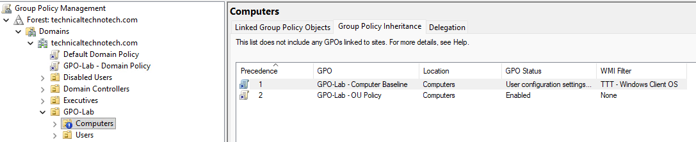
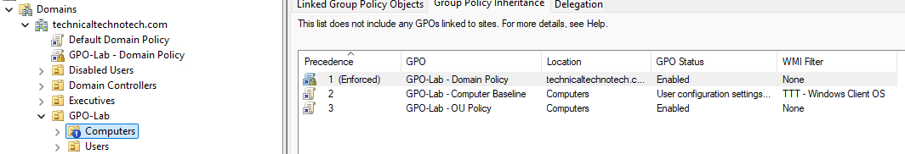
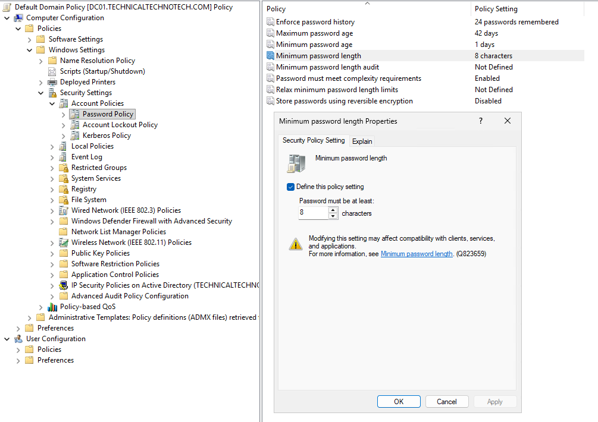
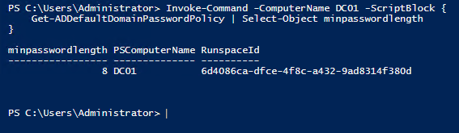

# Enforced Links & Domain-Based Group Policy

## Project Overview

This project focused on how Group Policy can be enforced across the domain and how the default Active Directory Group Policy Objects are used.

The lab covered:

- Enforced GPO links
- Block Inheritance vs Enforced
- Default Domain Policy
- Domain password policy
- Default Domain Controllers Policy
- Domain controller security settings
- User Rights Assignment
- Verification of effective domain password policy

The goal was to understand the difference between policies intended for the entire domain and policies specifically intended for domain controllers.

***

## Lab Environment

| System | Role |
|---|---|
| DC01 | Windows Server GUI Domain Controller / PDC Emulator |
| DC02 | Windows Server Core Domain Controller |
| MGMT01 | Windows 11 Management Workstation |
| CLIENT01 | Windows 11 Domain Client |
| Domain | technicaltechnotech.com |

Management was primarily performed from **MGMT01** using Group Policy Management Console (GPMC), RSAT, and PowerShell.

***

# 1. Testing an Enforced GPO Link

Previous testing demonstrated that **Block Inheritance** prevents normal inherited GPO links from higher levels of Active Directory from affecting an OU.

The existing lab GPO:

`GPO-Lab - Domain Policy`

was linked to the domain:

`technicaltechnotech.com`

The GPO link was then configured as:

`Enforced`

### Normal Inheritance

```text
Domain GPO
    ↓
Computers OU
    ↓
CLIENT01
```

### Block Inheritance

```text
Domain GPO
    ↓
    X
Block Inheritance
    ↓
CLIENT01
```

Normally, Block Inheritance prevents inherited GPO links from applying.

### Enforced + Block Inheritance



The domain-level GPO link was configured as **Enforced**.

```text
Enforced Domain GPO
        ↓
        ↓
Block Inheritance
        ↓
        ↓
     CLIENT01
```

The enforced GPO continued through the inheritance block.

This demonstrated that an **Enforced link cannot be blocked using Block Inheritance**.




***

## Enforced Applies to the Link

An important distinction from this lab was that **Enforced is configured on a GPO link**, not on the GPO itself.

The same GPO could theoretically be linked to multiple locations with different link behavior.

```text
GPO
├── Link to Domain → Enforced
└── Link to OU     → Normal
```

This reinforces the difference between a GPO and a GPO link:

- **GPO** = contains the settings
- **Link** = determines where the GPO can apply
- **Enforced** = modifies the behavior of a particular link

***

# 2. Default Domain Policy

The next part of the project examined the built-in:

`Default Domain Policy`

This GPO is created automatically when the Active Directory domain is created and is linked at the domain level.

```text
technicaltechnotech.com
│
├── Default Domain Policy
│
├── Domain Controllers
├── Workstations
├── Users
└── Other OUs
```

The Default Domain Policy is particularly important for defining **domain account policies**.

***

## Account Policies

The following location was examined:

```text
Computer Configuration
└── Policies
    └── Windows Settings
        └── Security Settings
            └── Account Policies
```

The three major categories examined were:

```text
Account Policies
├── Password Policy
├── Account Lockout Policy
└── Kerberos Policy
```

***

# 3. Password Policy

The Password Policy section contains domain password requirements such as:

- Enforce password history
- Maximum password age
- Minimum password age
- Minimum password length
- Password complexity requirements
- Reversible encryption settings

The existing minimum password length was:

`7 characters`

For the lab, it was changed to:

`8 characters`

```text
Minimum Password Length

7
↓
8
```



This provided hands-on experience modifying a domain account security policy.

The effective domain password policy can be inspected using PowerShell:

```powershell
Get-ADDefaultDomainPasswordPolicy
```

One of the properties returned by this command is:

```text
MinPasswordLength
```

The expected configured value after the change was:

```text
MinPasswordLength : 8
```



***

## Why This Is a Domain Policy

The password policy is not simply a password rule for DC01.

It defines password requirements for accounts within the Active Directory domain.

Conceptually:

```text
Default Domain Policy
        ↓
Domain Account Policy
        ↓
technicaltechnotech.com
        ↓
Domain Users
```

This helped distinguish a **domain account policy** from security settings that configure the domain controllers themselves.

***

# 4. Account Lockout Policy

The Account Lockout Policy was inspected.

Important settings include:

- Account lockout threshold
- Account lockout duration
- Reset account lockout counter after

For example:

```text
Account Lockout Threshold
        ↓
How many failed attempts?

Account Lockout Duration
        ↓
How long is the account locked?

Reset Account Lockout Counter
        ↓
When does the failed-attempt counter reset?
```

No Account Lockout Policy changes were required for this checkpoint.

***

# 5. Kerberos Policy

The Kerberos Policy section was also inspected.

Kerberos policies control authentication ticket behavior within the Active Directory domain.

This connected Group Policy with previous Active Directory troubleshooting experience involving authentication and Windows Time.

```text
Accurate Time
     ↓
Kerberos Authentication
     ↓
Domain Authentication
     ↓
Active Directory Services
```

The Kerberos settings were inspected but intentionally left unchanged.

***

# 6. Default Domain Controllers Policy

The project then examined the second major built-in GPO:

`Default Domain Controllers Policy`

Unlike the Default Domain Policy, this GPO is linked to the:

`Domain Controllers OU`

The lab contains two writable domain controllers:

```text
Domain Controllers OU
│
├── Default Domain Controllers Policy
│
├── DC01
└── DC02
```

Therefore, the policy provides security configuration specifically for the domain controllers.

***

# 7. User Rights Assignment

The following location was examined inside the Default Domain Controllers Policy:

```text
Computer Configuration
└── Policies
    └── Windows Settings
        └── Security Settings
            └── Local Policies
                └── User Rights Assignment
```

User Rights Assignment determines which security principals are allowed to perform particular operating system actions.

Examples include:

- Access this computer from the network
- Allow log on locally
- Back up files and directories
- Change the system time
- Log on as a batch job
- Restore files and directories
- Shut down the system

These are particularly important on domain controllers because DCs contain critical Active Directory services and require stricter administrative controls than ordinary workstations.

***

# 8. Allow Log On Locally

The following setting was inspected:

`Allow log on locally`

The existing configuration contained security principals including:

- Administrators
- Backup Operators
- Enterprise Domain Controllers
- SID-based entries displayed as `S-1-...`

The SID entries were not modified.

A SID appearing instead of a friendly account or group name indicates that the security principal is not currently being translated into a recognizable name in the management interface. The entries should not be removed without first determining what they represent.

No changes were made to **Allow log on locally** because unnecessarily modifying domain controller logon rights could disrupt administrative access.

This demonstrated an important administration principle:

> Inspect and understand an existing security policy before modifying it.

***

# Default Domain Policy vs Default Domain Controllers Policy

| Policy | Primary Purpose |
|---|---|
| Default Domain Policy | Domain account/security policy |
| Default Domain Controllers Policy | Security configuration for domain controllers |

Examples:

```text
Default Domain Policy
        ↓
Password Policy
Account Lockout Policy
Kerberos Policy
```

versus:

```text
Default Domain Controllers Policy
        ↓
User Rights Assignment
Security Options
DC-specific security configuration
```

***

# Domain Policy vs Workstation Policy

Another design concept learned during this checkpoint was that general desktop configuration should not automatically be placed inside the built-in default domain policies.

For example, settings such as:

- Desktop configuration
- Control Panel restrictions
- Windows interface settings
- Workstation-specific security configuration
- User environment configuration

are better organized into dedicated GPOs and linked to the appropriate workstation or user OUs.

Example:

```text
technicaltechnotech.com
│
├── Default Domain Policy
│   └── Domain account policy
│
├── Domain Controllers
│   └── Default Domain Controllers Policy
│
└── Workstations
    ├── Workstation Security GPO
    └── Workstation Configuration GPO
```

This provides cleaner separation between:

- Domain-wide account policy
- Domain controller security
- Workstation configuration
- User configuration

***

# Group Policy Concepts Combined So Far

The Group Policy labs have now demonstrated:

```text
GPO Created
    ↓
GPO Linked
    ↓
Scope Evaluated
    ↓
Security Filtering
    ↓
WMI Filtering
    ↓
LSDOU Processing
    ↓
Inheritance / Precedence
    ↓
Block Inheritance
    ↓
Enforced Links
    ↓
Effective Policy
```

Key questions when troubleshooting Group Policy are now:

```text
1. WHERE is the GPO linked?

2. WHO or WHAT is allowed to apply it?

3. Does a WMI filter allow it?

4. What other GPOs are being processed?

5. What is the LSDOU processing order?

6. What is the precedence?

7. Is inheritance blocked?

8. Is a higher-level link enforced?
```

***

# Verification Tools

Several tools can be used when managing or troubleshooting Group Policy.

### Force Group Policy Processing

```cmd
gpupdate /force
```

### View Applied Computer Policies

```cmd
gpresult /scope computer /r
```

### View Applied User Policies

```cmd
gpresult /scope user /r
```

### Inspect Domain Password Policy

```powershell
Get-ADDefaultDomainPasswordPolicy
```

### Group Policy Management Console

GPMC was used to inspect:

- GPO links
- Enforced status
- Block Inheritance
- Group Policy Inheritance
- Security Filtering
- WMI Filtering
- Default Domain Policy
- Default Domain Controllers Policy

***

# What I Learned

Through this project I learned:

- How an Enforced GPO link interacts with Block Inheritance
- That Enforced is a property of the GPO link rather than the GPO itself
- How domain-level Group Policy affects Active Directory
- The purpose of the Default Domain Policy
- How domain password policies are centrally managed
- The purpose of Account Lockout Policy
- The relationship between Kerberos policy and domain authentication
- The purpose of the Default Domain Controllers Policy
- How policies can specifically target domain controllers through the Domain Controllers OU
- How User Rights Assignment controls privileged operating system actions
- Why domain controller security policies should be modified carefully
- Why workstation and desktop configuration should generally use separate purpose-built GPOs rather than being placed in the default policies

***

# Skills Practiced

- Group Policy Management Console (GPMC)
- Group Policy administration
- GPO link management
- Enforced GPO links
- Block Inheritance
- GPO inheritance analysis
- Domain-level Group Policy
- Active Directory password policy
- Account security policy
- Kerberos policy inspection
- Domain controller security policy
- User Rights Assignment
- PowerShell Active Directory administration
- `Get-ADDefaultDomainPasswordPolicy`
- `gpupdate`
- `gpresult`
- Security policy analysis
- Windows Server administration
- Active Directory administration
