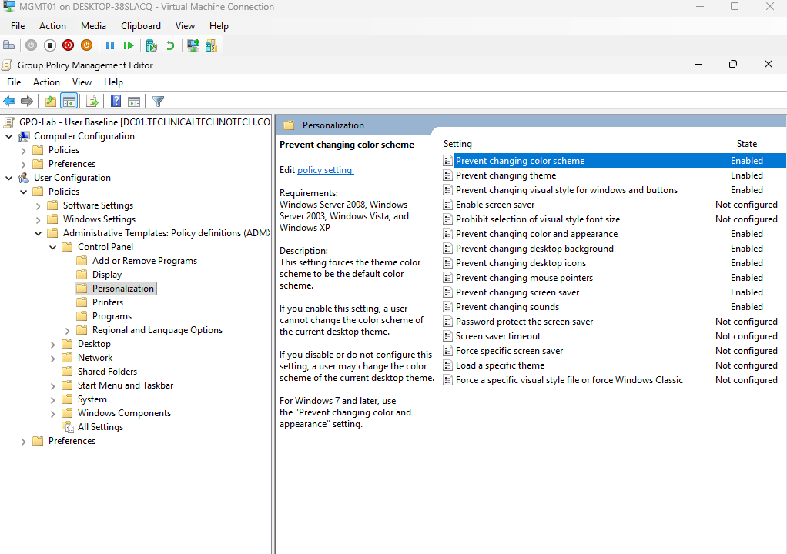
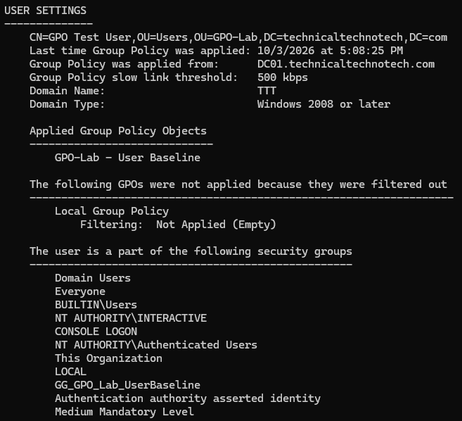
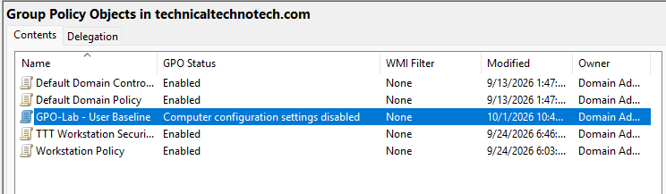
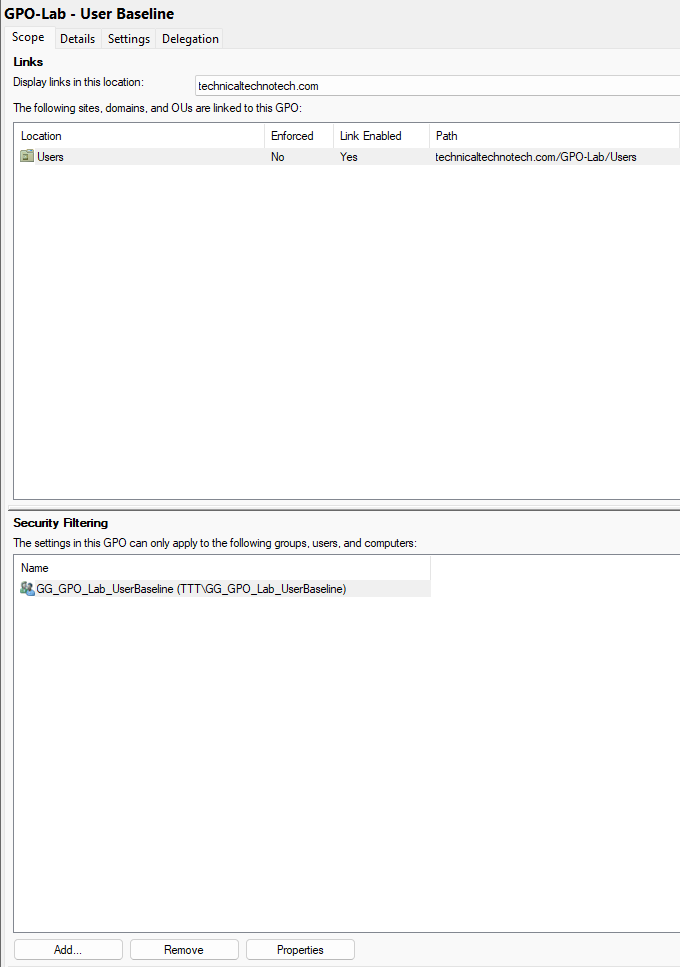
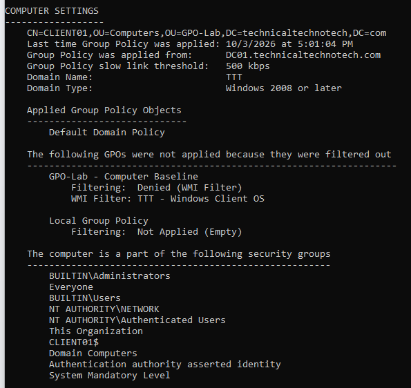
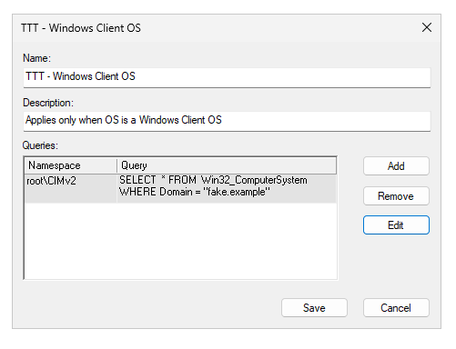
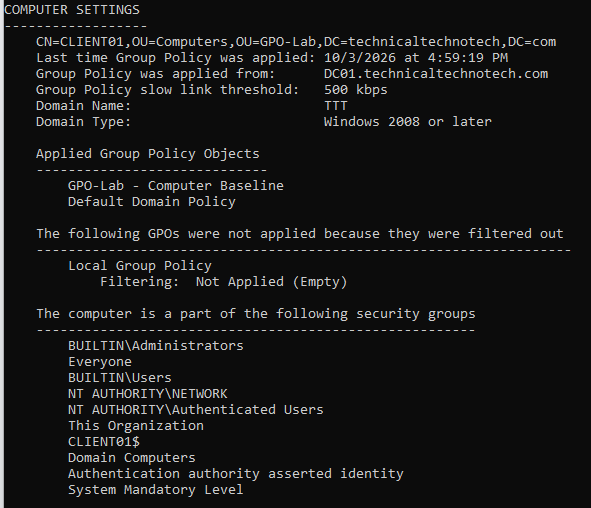

# GPO Fundamentals, Scoping & Filtering

## Project Overview

This project focuses on understanding how **Active Directory Group Policy** determines whether a policy is eligible to apply to a user or computer.

A dedicated Group Policy testing environment was created inside the `technicaltechnotech.com` domain so that GPO behavior could be tested without interfering with the normal production-style OU structure.

This covers:

- Creating and configuring Group Policy Objects
- GPOs vs. GPO links
- User Configuration vs. Computer Configuration
- Disabling unused GPO sections
- Starter GPOs
- OU-based policy scope
- Security Filtering
- WMI Filtering
- `gpupdate` and `gpresult`
- Group Policy troubleshooting
- Active Directory time synchronization troubleshooting encountered during testing

***

# Lab Environment

| System | Role |
|---|---|
| DC01 | Windows Server Domain Controller / PDC Emulator |
| DC02 | Windows Server Core Domain Controller |
| MGMT01 | Windows 11 Administrative Workstation |
| CLIENT01 | Windows 11 Domain-Joined Test Client |
| Hyper-V | Virtualization Platform |

**Domain:**

```text
technicaltechnotech.com
```

**NetBIOS Domain:**

```text
TTT
```

Administrative tasks were primarily performed remotely from **MGMT01** using tools such as:

- Group Policy Management Console
- Active Directory Users and Computers
- PowerShell
- Command Prompt
- RSAT

***

# GPO Test Environment

A dedicated OU structure was created for Group Policy testing.

```text
technicaltechnotech.com
│
└── GPO-Lab
    ├── Users
    │   ├── gpotest
    │   └── gpotest2
    │
    └── Computers
        └── CLIENT01
```

Using a dedicated GPO lab prevented testing from unnecessarily affecting the existing departmental and workstation OU structure.

***

# Creating the First GPO

The first test Group Policy Object was created:

```text
GPO-Lab - User Baseline
```

Several User Configuration settings were configured inside the GPO.



Initially, the GPO was intentionally left **unlinked**.

This demonstrated an important Group Policy concept:

> Creating and configuring a GPO does not automatically cause the policy to apply.

The GPO contains the configuration settings, while the **GPO link determines where the policy can potentially apply**.

```text
GPO
 │
 │ Link
 ▼
Site / Domain / OU
```

***

# Linking the User Baseline GPO

The following GPO:

```text
GPO-Lab - User Baseline
```

was linked to:

```text
GPO-Lab\Users
```

The test user `gpotest` was then used to verify Group Policy processing.

Group Policy was refreshed using:

```cmd
gpupdate /force
```

Applied policies were inspected using:

```cmd
gpresult /scope user /r
```

The User Baseline appeared under:

```text
Applied Group Policy Objects
```

This confirmed that the GPO was successfully linked and processed.



***

# User Configuration vs. Computer Configuration

Every GPO contains two primary configuration sections:

```text
Group Policy Object
│
├── Computer Configuration
│
└── User Configuration
```

## User Configuration

User Configuration settings are processed based on the **user account**.

```text
User
 ↓
User Configuration
```

These settings can follow the user when they sign into applicable domain computers.

## Computer Configuration

Computer Configuration settings are processed based on the **computer object**.

```text
Computer
 ↓
Computer Configuration
```

The settings apply to the computer regardless of which user signs in, assuming the normal Group Policy requirements are satisfied.

### Memory Hook

> **User Configuration follows the user. Computer Configuration follows the computer.**

***

# Disabling Unused GPO Sections

Because `GPO-Lab - User Baseline` only required User Configuration settings, its unused Computer Configuration section was disabled.

This was configured through:

```text
GPO Status
→ Computer configuration settings disabled
```



Conceptually:

```text
GPO-Lab - User Baseline
│
├── Computer Configuration   Disabled
│
└── User Configuration       Enabled
```

Disabling an unused section tells Windows that there are no settings in that portion of the GPO that need to be processed.

This can reduce unnecessary Group Policy processing and also makes the intended purpose of the GPO clearer.

***

# Starter GPOs

A **Starter GPO** was created to understand reusable Group Policy baseline configurations.

Starter GPOs provide a starting point for certain **Administrative Template** settings.

Conceptually:

```text
Starter GPO
    ↓
Baseline configuration
    ↓
Create normal GPO
    ↓
Customize independently
```

A normal GPO was created using the Starter GPO as its source.

This demonstrated that Starter GPOs behave like **initial configuration templates**, rather than centrally linked policies.

An important behavior was also observed:

> Changes made to a Starter GPO do not automatically update GPOs that were previously created from it.

Instead:

```text
Starter GPO
     │
     │ Copies baseline during creation
     ▼
Normal GPO
```

Once created, the normal GPO can be modified independently.

***

# Group Policy Security Filtering

The next stage tested how **Security Filtering** further controls GPO application.

Two users were placed inside the same OU:

```text
GPO-Lab
└── Users
    ├── gpotest
    └── gpotest2
```

Both users were therefore underneath the same GPO link.

A Global Security Group was created:

```text
GG_GPO_Lab_UserBaseline
```

Only the following user was added:

```text
gpotest
```

The second test user was intentionally excluded:

```text
gpotest2
```

The intended result was:

```text
GG_GPO_Lab_UserBaseline
│
└── gpotest        Allowed

gpotest2            Not a member
```

***

# Configuring Security Filtering

Security Filtering on:

```text
GPO-Lab - User Baseline
```

was changed so that policy application was restricted to:

```text
GG_GPO_Lab_UserBaseline
```

This produced two different results despite both users existing inside the same OU:

```text
Users OU
│
├── gpotest
│      ↓
│   Security Group Member
│      ↓
│   GPO Applied
│
└── gpotest2
       ↓
    Not a Member
       ↓
    Denied (Security)
```

This demonstrated:

> Being located underneath an OU with a linked GPO does not guarantee that the GPO will apply.



***

# Security Filtering Troubleshooting

During initial testing, `gpotest` was also denied the User Baseline policy.

The issue was traced to GPO permissions after modifying Security Filtering.

The GPO permissions were reviewed through:

```text
Group Policy Management
→ GPO
→ Delegation
→ Advanced
```

The configuration was adjusted so that the required principals had appropriate **Read** and **Apply Group Policy** permissions.

The resulting design allowed the GPO to be readable while restricting actual application to the intended security group.

After correcting the permissions and refreshing the user's security token, testing succeeded.

Because group membership had changed, the user signed out and back in before retesting.

This reinforced an important distinction:

> `gpupdate /force` refreshes Group Policy, but signing out and back in may still be necessary when group membership changes because the user's existing security token may not contain the new membership.

***

# Security Filtering Verification

Testing was performed with:

```cmd
gpupdate /force
```

and:

```cmd
gpresult /scope user /r
```

## gpotest

Result:

```text
GPO-Lab - User Baseline
Applied
```

## gpotest2

Result:

```text
GPO-Lab - User Baseline
Denied (Security)
```

The test successfully demonstrated selective policy application.

```text
Same OU
Same GPO Link
Different Security Membership
            ↓
Different GPO Result
```

***

# WMI Filtering

The next stage tested **WMI Filtering**.

WMI filtering allows Group Policy application to depend on information retrieved from Windows Management Instrumentation.

Examples of potential conditions include:

- Operating system information
- Computer properties
- Domain membership
- Hardware characteristics
- System configuration

A separate Computer Configuration GPO was created:

```text
GPO-Lab - Computer Baseline
```

It was linked to:

```text
GPO-Lab\Computers
```

CLIENT01 was temporarily moved into this OU for testing.

```text
GPO-Lab
└── Computers
    └── CLIENT01
```

Because this GPO was designed for computer settings, its unused User Configuration section was disabled.

```text
GPO-Lab - Computer Baseline
│
├── Computer Configuration   Enabled
└── User Configuration       Disabled
```

***

# Creating the WMI Filter

A WMI filter was created under:

```text
Group Policy Management
→ WMI Filters
```

The filter used the namespace:

```text
root\CIMv2
```

A query based on the computer's domain membership was ultimately used.

Example:

```sql
SELECT * FROM Win32_ComputerSystem WHERE Domain = "technicaltechnotech.com"
```

The filter was attached to:

```text
GPO-Lab - Computer Baseline
```

The logic became:

```text
CLIENT01
   ↓
Located in Computers OU?
   ↓
Yes
   ↓
Computer Baseline linked?
   ↓
Yes
   ↓
Security Filtering permits processing?
   ↓
Yes
   ↓
WMI condition evaluates TRUE?
   ↓
Yes
   ↓
GPO Applies
```

***

# WMI Filtering Troubleshooting

The WMI filtering stage required troubleshooting before the filter worked correctly.

Initial tests resulted in:

```text
Denied (WMI Filter)
```



Different operating-system properties were investigated while determining why the filter was not matching CLIENT01.

PowerShell was used to query WMI/CIM information directly.

For example:

```powershell
Get-CimInstance Win32_ComputerSystem | Select-Object Domain
```

The WMI query itself was then tested independently from Group Policy:

```powershell
Get-CimInstance -Query 'SELECT * FROM Win32_ComputerSystem WHERE Domain = "technicaltechnotech.com"'
```

The direct query successfully returned CLIENT01.

This proved that:

```text
WMI Service           Working
WMI Class             Working
Domain Property       Working
Query Condition       Working
```

The issue was ultimately identified as a **typo in the WMI query configured in Group Policy**.

After correcting the query, the WMI filter evaluated correctly.

This troubleshooting process demonstrated why testing a WMI query independently can be useful before assuming that the GPO itself is malfunctioning.

***

# WMI Filtering Verification

The Computer Baseline was tested using:

```cmd
gpupdate /force
```

followed by:

```cmd
gpresult /scope computer /r
```

With the correct WMI condition:

```text
Domain = technicaltechnotech.com
```

CLIENT01 satisfied the filter and the Computer Baseline was eligible to apply.

The WMI condition can also be deliberately changed to a false value to demonstrate rejection:

```sql
SELECT * FROM Win32_ComputerSystem WHERE Domain = "fake.example"
```



Conceptually:

```text
Correct Domain
     ↓
WMI = TRUE
     ↓
GPO Applies


Incorrect Domain
     ↓
WMI = FALSE
     ↓
Denied (WMI Filter)
```



***

# Security Filtering vs. WMI Filtering

The project demonstrated two different ways of controlling GPO application.

| Filtering Method | Primary Question |
|---|---|
| Security Filtering | Is this user/computer authorized to apply the GPO? |
| WMI Filtering | Does this computer satisfy the required system condition? |

Conceptually:

```text
GPO Link
   ↓
Correct location?
   ↓
Security Filtering
   ↓
Authorized?
   ↓
WMI Filtering
   ↓
System matches condition?
   ↓
GPO processing continues
```

***

# Group Policy Troubleshooting Tools

Several tools were used throughout the project.

## gpupdate

Forces Group Policy to refresh:

```cmd
gpupdate /force
```

***

## gpresult

Displays Resultant Set of Policy information.

User policies:

```cmd
gpresult /scope user /r
```

Computer policies:

```cmd
gpresult /scope computer /r
```

HTML report:

```cmd
gpresult /h C:\GPOReport.html
```

The HTML report provides a more detailed view of applied and denied policies.

***

## Event Viewer

Group Policy processing events can be investigated under:

```text
Event Viewer
→ Applications and Services Logs
→ Microsoft
→ Windows
→ GroupPolicy
→ Operational
```

This can assist with diagnosing Group Policy processing failures.

***

## PowerShell WMI/CIM Testing

WMI conditions can be tested independently before using them in Group Policy.

Example:

```powershell
Get-CimInstance Win32_ComputerSystem
```

Specific property:

```powershell
Get-CimInstance Win32_ComputerSystem |
    Select-Object Domain
```

Direct WMI-style query:

```powershell
Get-CimInstance -Query 'SELECT * FROM Win32_ComputerSystem WHERE Domain = "technicaltechnotech.com"'
```

This was particularly useful when troubleshooting the WMI filter.

***

# Infrastructure Troubleshooting Encountered During the Project

During Group Policy testing, several systems began reporting authentication and Group Policy processing errors related to time synchronization.

Symptoms included:

- `gpupdate /force` failing or completing incompletely
- Domain authentication problems
- `gpotest` login problems
- Client/server time synchronization errors
- Domain controllers and clients using inconsistent time sources

The issue temporarily prevented further Group Policy testing.

***

# Domain Time Synchronization Investigation

The environment was inspected and showed inconsistent time sources.

Some systems were using:

```text
VM IC Time Synchronization Provider
```

while DC01 was configured to use Windows Time.

DC01 was confirmed as the domain's:

```text
PDC Emulator
```

The intended domain time hierarchy was:

```text
External Time Source
        ↓
DC01
PDC Emulator
        ↓
Domain Systems
        ↓
DC02
MGMT01
CLIENT01
```

However, DC01's clock was discovered to be approximately **two days incorrect**.

Because the PDC Emulator serves as the primary time authority for the AD domain hierarchy, this created significant synchronization and authentication problems throughout the lab.

***

# Hyper-V Time Synchronization

Hyper-V Integration Services were also providing VM time to several virtual machines.

For testing, Hyper-V Time Synchronization was disabled where appropriate so that Windows Time could control synchronization.

Example:

```powershell
Disable-VMIntegrationService -VMName "CLIENT01" -Name "Time Synchronization"
```

The same concept was applied to other applicable VMs.

This prevented the Hyper-V host time provider from competing with the intended Windows domain time configuration.

***

# Windows Time Configuration

Domain systems were configured to synchronize against the intended domain time source.

Useful Windows Time commands included:

```cmd
w32tm /query /source
```

```cmd
w32tm /query /status
```

```cmd
w32tm /query /configuration
```

```cmd
w32tm /resync /force
```

```cmd
w32tm /stripchart /computer:DC01 /samples:5 /dataonly
```

The `stripchart` command was particularly useful for identifying a large time difference between systems.

***

# Server Core Time Management

Because DC02 runs Windows Server Core, its date and time were managed through PowerShell rather than a traditional GUI.

Check the current date/time:

```powershell
Get-Date
```

Set the date/time:

```powershell
Set-Date -Date "10/03/2026 5:35 PM"
```

Check the configured time zone:

```powershell
Get-TimeZone
```

Set the time zone when necessary:

```powershell
Set-TimeZone -Id "Central Standard Time"
```

This provided additional practice administering Windows Server Core entirely from the command line.

***

# Why Time Matters to Active Directory

This troubleshooting incident reinforced the relationship between:

```text
Accurate Time
     ↓
Kerberos Authentication
     ↓
Domain Authentication
     ↓
Group Policy Processing
```

Active Directory authentication relies heavily on synchronized clocks.

A major time difference can therefore produce symptoms that initially appear to be:

- Group Policy failures
- Login failures
- Domain controller communication problems
- Authentication failures

when the underlying issue is actually **time synchronization**.

The time synchronization incident will also be documented separately as an infrastructure troubleshooting project because it affected more than just Group Policy.

***

# What I Learned

- A GPO can exist without being linked anywhere.
- A GPO link determines where a GPO can potentially apply.
- User Configuration targets user objects.
- Computer Configuration targets computer objects.
- Unused User or Computer Configuration sections can be disabled.
- Starter GPOs provide reusable starting configurations for Administrative Template settings.
- Existing GPOs do not automatically inherit future changes made to the Starter GPO from which they were created.
- OU placement alone does not guarantee that a GPO applies.
- Security Filtering can restrict a GPO to specific security principals.
- GPO permissions include both the ability to read a policy and the ability to apply it.
- Group membership changes may require signing out and back in to obtain a new security token.
- WMI filters can dynamically determine GPO applicability based on system information.
- WMI queries can be tested independently with PowerShell.
- `gpresult` can identify policies rejected because of Security Filtering or WMI Filtering.
- Group Policy failures can originate from underlying infrastructure problems rather than the GPO itself.
- Accurate domain time is critical for Kerberos authentication and reliable Group Policy processing.
- The PDC Emulator plays an important role in the Active Directory time hierarchy.
- Server Core administration can be performed remotely or directly through PowerShell and command-line tools.
- Troubleshooting is easier when each layer is tested independently instead of changing multiple settings simultaneously.

***

# Skills Practiced

- Active Directory Domain Services
- Group Policy Management
- Group Policy Objects
- GPO Linking
- Organizational Unit Design
- User Configuration
- Computer Configuration
- Starter GPOs
- Security Filtering
- WMI Filtering
- Group Policy Permissions
- PowerShell
- WMI / CIM
- `gpupdate`
- `gpresult`
- Event Viewer
- Windows Time Service
- Kerberos troubleshooting
- Windows Server Core administration
- Hyper-V Integration Services
- Domain troubleshooting
- Policy verification
- Root cause analysis
