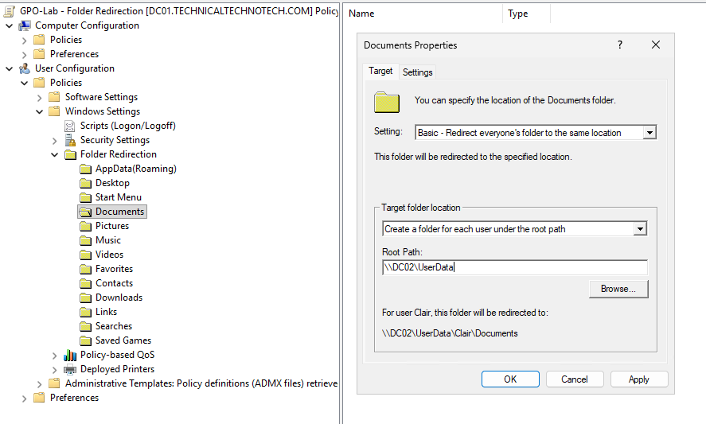
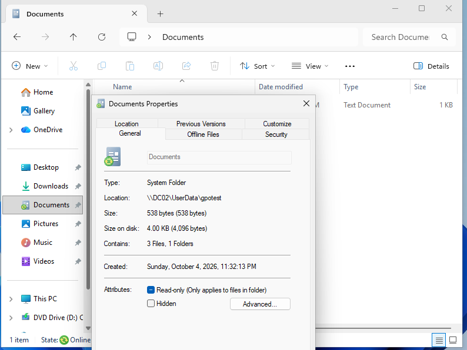
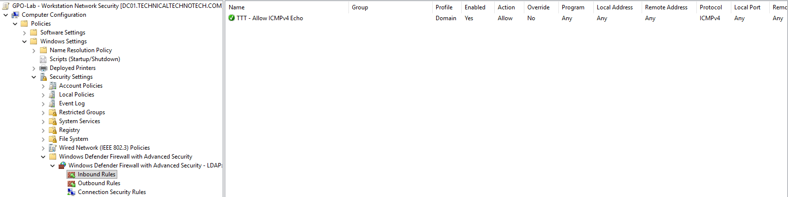
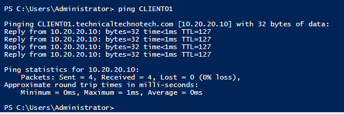
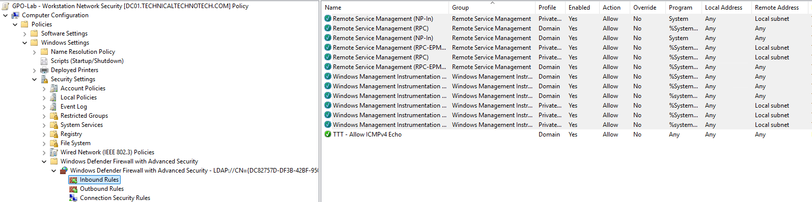
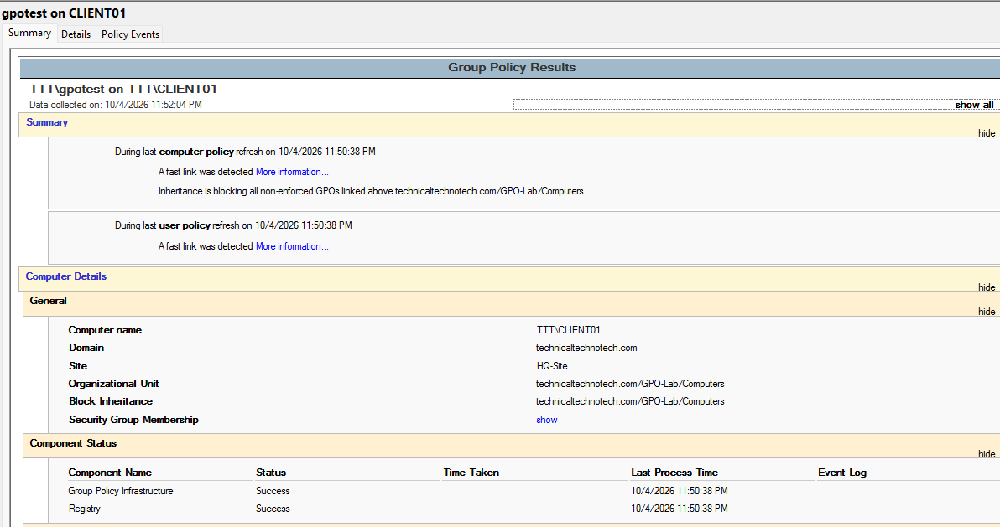

# Group Policy User Environment, Network Security & RSoP

## Project Overview

This project expanded the Group Policy lab beyond basic processing, filtering, inheritance, and domain policies.

The project focused on three practical Group Policy administration areas:

1. **Folder Redirection**
2. **Centralized Network and Firewall Configuration**
3. **Resultant Set of Policy (RSoP) and Group Policy Troubleshooting Tools**

The lab also included real troubleshooting involving NTFS permissions, Folder Redirection client-side extension failures, Windows Firewall, RPC, and remote Group Policy reporting.

***

# Lab Environment

| System | Role |
|---|---|
| DC01 | Windows Server GUI Domain Controller / PDC Emulator |
| DC02 | Windows Server Core Domain Controller / File Server |
| MGMT01 | Windows 11 Management Workstation |
| CLIENT01 | Windows 11 Domain Client |
| Domain | `technicaltechnotech.com` |
| NetBIOS | `TTT` |

Administration was primarily performed from **MGMT01** using:

- Group Policy Management Console (GPMC)
- RSAT
- PowerShell
- Command Prompt
- Event Viewer

DC02 was administered primarily through PowerShell because it runs **Windows Server Core**.

***

# Folder Redirection

## Objective

The first goal was to centrally redirect a user's **Documents** folder from CLIENT01 to a network file share hosted on DC02.

Instead of storing Documents locally:

```text
C:\Users\gpotest\Documents
```

the desired configuration was:

```text
\\DC02\UserData\gpotest\Documents
```

This provides centralized storage of user data rather than keeping the files exclusively on the workstation.

***

# Creating the Folder Redirection Share

A folder was created on DC02:

```text
C:\UserData
```

It was shared as:

```text
\\DC02\UserData
```

The SMB share was created using PowerShell:

```powershell
New-SmbShare -Name "UserData" -Path "C:\UserData" -ChangeAccess "Domain Users"
```

The share could be verified using:

```powershell
Get-SmbShare -Name "UserData"
```

This demonstrated the difference between:

```text
Physical Path
C:\UserData

        ↓

SMB Share

        ↓

UNC Path
\\DC02\UserData
```

***

# Share Permissions vs NTFS Permissions

An important part of this project was understanding that an SMB share involves two permission layers:

```text
User
 ↓
Share Permission
 ↓
NTFS Permission
 ↓
Folder/File
```

The effective access is affected by both layers.

For the Folder Redirection root, users needed permission to create their personal directory without automatically receiving access to every other user's directory.

Conceptually:

```text
C:\UserData
│
├── gpotest
│   └── Documents
│
├── gpotest2
│   └── Documents
│
└── Other Users...
```

***

# Folder Redirection NTFS Permissions

The root Folder Redirection directory was configured around the following permission model:

| Principal | Purpose |
|---|---|
| SYSTEM | Full Control |
| Administrators | Full Control |
| CREATOR OWNER | Full Control on created child objects |
| TTT\Domain Users | Read/Execute and ability to create folders at the root |

Domain Users required the ability to:

```text
Create folders / append data
```

on the Folder Redirection root.

This allows:

```text
TTT\gpotest
      ↓
\\DC02\UserData
      ↓
Create personal directory
      ↓
\\DC02\UserData\gpotest
```

while avoiding a design where Domain Users automatically receive Modify permissions throughout every user's directory.

***

# CREATOR OWNER

`CREATOR OWNER` was used to allow the user who creates a child directory to receive appropriate control over that directory.

The configuration concept was:

```text
C:\UserData
│
│ Domain Users
│ → Can create personal directory
│
├── gpotest
│      ↑
│      CREATOR OWNER
│
└── gpotest2
       ↑
       CREATOR OWNER
```

An example `icacls` configuration used during the lab was:

```cmd
icacls C:\UserData /grant "CREATOR OWNER:(OI)(CI)(IO)(F)"
```

Where:

```text
OI = Object Inherit
CI = Container Inherit
IO = Inherit Only
F  = Full Control
```

Permissions were inspected using:

```cmd
icacls C:\UserData
```

***

# Configuring the Folder Redirection GPO

A new GPO was created:

```text
GPO-Lab - Folder Redirection
```

It was linked to the OU containing the Group Policy test users.

The setting was configured under:

```text
User Configuration
└── Policies
    └── Windows Settings
        └── Folder Redirection
            └── Documents
```

The configuration used:

```text
Setting:
Basic - Redirect everyone's folder to the same location

Target folder location:
Create a folder for each user under the root path

Root Path:
\\DC02\UserData
```



This allowed Windows to generate a user-specific target similar to:

```text
\\DC02\UserData\%USERNAME%\Documents
```

***

# Folder Redirection Troubleshooting

The Folder Redirection configuration initially failed.

Group Policy itself appeared to apply successfully:

```cmd
gpresult /r
```

showed:

```text
GPO-Lab - Folder Redirection
```

under the user's applied GPOs.

However, the actual Documents path remained local.

The current Documents location was checked using:

```powershell
[Environment]::GetFolderPath("MyDocuments")
```

It continued to return:

```text
C:\Users\gpotest\Documents
```

instead of the expected network location.

***

## Client-Side Extension Failure

Event Viewer reported:

```text
Event ID 1085
```

indicating a failure while processing a Group Policy client-side extension.

The failing extension was associated with:

```text
Folder Redirection
```

This demonstrated an important troubleshooting distinction:

```text
GPO applies successfully
        ↓
Client-side extension processes settings
        ↓
Specific setting can still fail
```

Therefore:

> A GPO appearing under Applied Group Policy Objects does not necessarily mean every setting inside that GPO was successfully implemented.

***

# Troubleshooting the NTFS Permissions

The Folder Redirection root permissions were reviewed.

The Domain Users permissions were adjusted so users could create their own folders under:

```text
C:\UserData
```

The lab also discovered an existing:

```text
C:\UserData\gpotest
```

folder that had been created during earlier failed attempts.

Rather than continuing with the potentially incorrect folder state, the test folder was removed so Folder Redirection could create it again using the corrected permissions.

```powershell
Remove-Item "C:\UserData\gpotest" -Recurse -Force
```

The root permissions were verified again:

```cmd
icacls C:\UserData
```

The Folder Redirection GPO was then processed again.

***

# Successful Folder Redirection

After correcting the root permissions and removing the previous test directory, the policy successfully created the user directory and redirected Documents.

The final workflow was:

```text
gpotest logs into CLIENT01
        ↓
User Group Policy processes
        ↓
Folder Redirection CSE
        ↓
\\DC02\UserData
        ↓
gpotest directory created
        ↓
Documents redirected
        ↓
SUCCESS
```

The redirected path could be verified using:

```powershell
[Environment]::GetFolderPath("MyDocuments")
```

The final design was:

```text
\\DC02\UserData
└── gpotest
    └── Documents
```



***

# Folder Redirection Troubleshooting Lesson

The troubleshooting process demonstrated several different layers that must work together:

```text
GPO Scope
   ↓
User receives GPO
   ↓
Folder Redirection CSE
   ↓
SMB Share
   ↓
Share Permissions
   ↓
NTFS Permissions
   ↓
User Folder Creation
   ↓
Folder Redirection
```

A failure at one layer can prevent the final setting from being implemented even when Group Policy itself appears to apply.

***

# Network Security Through Group Policy

## Objective

The second checkpoint demonstrated centralized management of Windows workstation network security through Group Policy.

Instead of modifying CLIENT01's IP address, DNS configuration, or other settings that could interfere with Active Directory connectivity, the lab focused on:

**Windows Defender Firewall with Advanced Security**

A new GPO was created:

```text
GPO-Lab - Workstation Network Security
```

and linked to:

```text
GPO-Lab
└── Computers
    └── CLIENT01
```

***

# Windows Firewall Profiles

The firewall configuration was accessed under:

```text
Computer Configuration
└── Policies
    └── Windows Settings
        └── Security Settings
            └── Windows Defender Firewall
                with Advanced Security
```

Windows provides three firewall profiles:

```text
Domain Profile
Private Profile
Public Profile
```

Because CLIENT01 is a domain-connected workstation, the lab focused on the:

```text
Domain Profile
```

The Domain Profile was configured with:

```text
Firewall State:
On

Inbound Connections:
Block by default

Outbound Connections:
Allow by default
```

Conceptually:

```text
CLIENT01
    ↓
Domain Network
    ↓
Windows Firewall
    ↓
Inbound → Block unless explicitly allowed
Outbound → Allow
```

***

# Verifying Computer Group Policy

Because the firewall configuration is a **Computer Configuration**, the effective computer policy was checked using:

```cmd
gpresult /scope computer /r
```

The report confirmed that:

```text
GPO-Lab - Workstation Network Security
```

was applied to CLIENT01.

This reinforced the distinction between:

```text
Folder Redirection
→ User Configuration
→ follows the user

Firewall Configuration
→ Computer Configuration
→ follows the computer
```

***

# Deploying an ICMP Firewall Rule

An inbound firewall rule was created centrally through Group Policy.

The rule was configured under:

```text
Windows Defender Firewall
with Advanced Security
└── Inbound Rules
```

The rule allowed:

```text
Protocol:
ICMPv4

ICMP Type:
Echo Request

Action:
Allow

Profile:
Domain
```

The rule was named:

```text
TTT - Allow ICMPv4 Echo Request
```



Conceptually:

```text
MGMT01
   │
   │ ICMP Echo Request
   ↓
CLIENT01 Firewall
   │
   ├── Unapproved inbound traffic → Block
   │
   └── ICMP Echo Request → Allow
```

***

# Testing the Firewall Rule

From MGMT01:

```powershell
ping CLIENT01
```

CLIENT01 successfully responded to the ICMP requests.



The local firewall configuration on CLIENT01 was then inspected, and the centrally deployed inbound rule was visible.

This confirmed:

```text
GPO created on management system
        ↓
GPO applied to CLIENT01
        ↓
Firewall configuration delivered
        ↓
Inbound rule created
        ↓
Ping succeeds
```

This demonstrated centralized firewall management without manually creating the rule directly on CLIENT01.

***

# RPC / Remote Management Troubleshooting

When attempting to use the **Group Policy Results Wizard** from MGMT01, CLIENT01 could not initially be queried.

The wizard reported an RPC-related failure.

At this point:

```text
MGMT01 → CLIENT01 ping     ✓

MGMT01 → CLIENT01 RPC/WMI  ✗
```

This demonstrated an important networking concept:

> Successful ping does not prove that application or management protocols are reachable.

ICMP connectivity was working, but the Windows remote-management traffic required by the Group Policy Results Wizard was not.

***

# Deploying Remote Management Firewall Rules

The existing:

```text
GPO-Lab - Workstation Network Security
```

was expanded with predefined Windows Firewall rules for remote administration.

Rules associated with:

```text
Windows Management Instrumentation (WMI)
```

and:

```text
Remote Service Management
```

were enabled for the Domain profile.



The policy was refreshed on CLIENT01 and the rules were verified locally.

The resulting path became:

```text
MGMT01
   ↓
RPC / WMI
   ↓
CLIENT01 Firewall
   ↓
Predefined management rules
   ↓
Remote Group Policy query
   ↓
SUCCESS
```

After the firewall changes, the **Group Policy Results Wizard successfully queried CLIENT01**.

This combined Group Policy administration, Windows Firewall configuration, networking, and troubleshooting in a single practical scenario.

***

# Checkpoint 3 — Resultant Set of Policy (RSoP)

The final checkpoint focused on tools used to determine which Group Policy settings apply to users and computers.

The lab used:

- `gpresult`
- Group Policy Results Wizard
- Group Policy Modeling Wizard

***

# gpresult

`gpresult` provides a quick command-line method for examining effective Group Policy.

Examples used throughout the lab included:

```cmd
gpresult /r
```

User-specific results:

```cmd
gpresult /scope user /r
```

Computer-specific results:

```cmd
gpresult /scope computer /r
```

A detailed HTML report can also be generated:

```cmd
gpresult /h C:\gpresult.html
```

When administrative privileges were required, an administrative command session could be opened using:

```cmd
runas /user:TTT\Administrator cmd
```

***

# Group Policy Results Wizard

The **Group Policy Results Wizard** was run from GPMC on MGMT01.

It was used to remotely query:

```text
Computer:
CLIENT01

User:
TTT\gpotest
```



The resulting report provided information about:

- Applied GPOs
- Denied GPOs
- User Configuration
- Computer Configuration
- Security filtering
- WMI filtering
- Group Policy processing
- Effective settings

Examples of policies visible through the results included:

```text
Computer Configuration:
GPO-Lab - Workstation Network Security

User Configuration:
GPO-Lab - Folder Redirection
```

This provided a more detailed graphical view of effective policy than a basic `gpresult /r` output.

***

# Group Policy Modeling Wizard

The **Group Policy Modeling Wizard** was then used to simulate Group Policy processing.

Unlike Group Policy Results, Modeling does not simply report what already happened.

It can answer:

> What would happen if the environment changed?

An initial model was created using:

```text
User:
gpotest

Computer:
CLIENT01
```

The report initially looked similar to a standard Group Policy report because it simulated the current configuration.

The real value became apparent when the simulated Active Directory location was changed.

***

# Simulating an OU Move

CLIENT01 was currently located under:

```text
GPO-Lab
└── Computers
    └── CLIENT01
```

Using Group Policy Modeling, CLIENT01 was simulated as if it were located under another OU such as:

```text
Workstations
└── CLIENT01
```

CLIENT01 was **not actually moved**.

The Modeling Wizard recalculated which GPOs would apply under the simulated location.

This produced different effective GPO results.

```text
REAL ENVIRONMENT

CLIENT01
    ↓
GPO-Lab\Computers
    ↓
Current GPO Set


SIMULATED ENVIRONMENT

CLIENT01
    ↓
Workstations
    ↓
Different GPO Set
```

This demonstrated how administrators can evaluate the impact of Active Directory changes before implementing them.

For example:

> What policies would 200 workstations receive if they were moved into a new OU?

The Modeling Wizard can help answer that question before the actual migration occurs.

***

# RSoP Tool Comparison

| Tool | Primary Purpose |
|---|---|
| `gpresult` | Quick command-line effective policy check |
| Group Policy Results Wizard | Detailed report of what actually applied |
| Group Policy Modeling Wizard | Simulates what would apply under different conditions |

A simple troubleshooting workflow is:

```text
Something isn't working
        ↓
gpresult
        ↓
What GPOs applied?
        ↓
Group Policy Results
        ↓
Detailed effective configuration
        ↓
Group Policy Modeling
        ↓
Test possible configuration changes
```

***

# What I Learned

Through this project I learned:

- How Folder Redirection centralizes user data
- How to create an SMB share using PowerShell
- The difference between share permissions and NTFS permissions
- Why Folder Redirection root permissions must be designed carefully
- How `CREATOR OWNER` works with user-created directories
- How Domain Users can be permitted to create personal directories without granting broad access to other users' data
- How User Configuration differs from Computer Configuration
- How Group Policy client-side extensions process specific policy areas
- That a GPO can appear as applied while an individual client-side extension still fails
- How Event ID 1085 can indicate a Group Policy client-side extension processing failure
- How to troubleshoot Folder Redirection failures
- How to centrally configure Windows Defender Firewall
- How Windows Domain, Private, and Public firewall profiles differ
- How to deploy inbound firewall rules using Group Policy
- How to centrally allow ICMP Echo Requests
- Why successful ping does not prove RPC/WMI connectivity
- How Windows Firewall can affect remote administration
- How to enable WMI and Remote Service Management access through Group Policy
- How `gpresult` can verify effective Group Policy
- How the Group Policy Results Wizard reports what actually happened
- How Group Policy Modeling simulates future configuration changes
- How to model an OU move without actually moving a computer
- How RSoP tools can be used before and after Group Policy changes

***

# Skills Practiced

- Active Directory Domain Services
- Group Policy Management
- Group Policy Management Console (GPMC)
- Folder Redirection
- SMB file sharing
- UNC paths
- NTFS permissions
- Share permissions
- `CREATOR OWNER`
- Windows Server Core administration
- PowerShell
- `New-SmbShare`
- `Get-SmbShare`
- `Get-Acl`
- `icacls`
- Windows Defender Firewall with Advanced Security
- Firewall profiles
- Inbound firewall rules
- ICMP
- RPC
- WMI
- Remote Service Management
- Group Policy client-side extensions
- Event Viewer
- Event ID 1085 troubleshooting
- `gpupdate`
- `gpresult`
- Resultant Set of Policy (RSoP)
- Group Policy Results Wizard
- Group Policy Modeling Wizard
- Group Policy troubleshooting
- Windows Server administration
- Remote Windows administration
