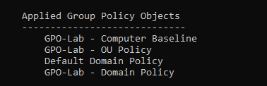
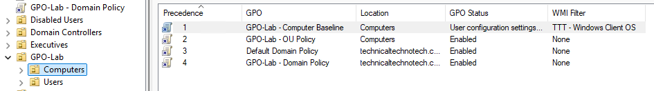
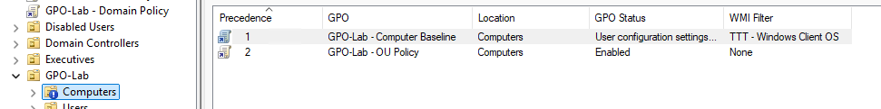
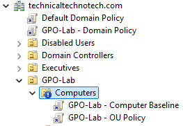

# LSDOU, GPO Inheritance & Block Inheritance

## Project Overview

This checkpoint focused on understanding how Group Policy flows through Active Directory and how policies inherited from higher levels affect computers inside Organizational Units.

The lab focused specifically on three concepts:

1. **LSDOU Processing**
2. **GPO Inheritance**
3. **Block Inheritance**

The goal was to answer:

> **How do GPOs flow through Active Directory, and how can inherited policies be stopped?**

***

# Lab Environment

| System | Role |
|---|---|
| DC01 | Windows Server Domain Controller |
| DC02 | Windows Server Core Domain Controller |
| MGMT01 | Windows 11 Administrative Workstation |
| CLIENT01 | Windows 11 Domain-Joined Test Client |
| Hyper-V | Virtualization Platform |

**Domain:**

```text
technicaltechnotech.com
```

Administrative tasks were primarily performed from **MGMT01** using the Group Policy Management Console.

***

# GPO Lab Structure

The existing Group Policy testing environment was used.

```text
technicaltechnotech.com
│
└── GPO-Lab
    ├── Users
    │
    └── Computers
        └── CLIENT01
```

CLIENT01 was located inside:

```text
GPO-Lab\Computers
```

This allowed Domain-level and OU-level Group Policy behavior to be compared.

***

# 1. LSDOU Processing

Group Policy normally processes according to the following hierarchy:

```text
Local
  ↓
Site
  ↓
Domain
  ↓
OU
```

This is commonly remembered as:

```text
LSDOU
```

Where:

| Letter | Level |
|---|---|
| L | Local |
| S | Site |
| D | Domain |
| OU | Organizational Unit |

When multiple applicable GPOs configure the same setting differently, policies processed later generally have higher precedence.

***

# Creating Conflicting Policy Levels

Two GPOs were used to demonstrate the relationship between Domain-level and OU-level policies.

## Domain Policy

Created:

```text
GPO-Lab - Domain Policy
```

Linked to:

```text
technicaltechnotech.com
```

This represented a policy applied broadly at the domain level.

***

## OU Policy

Created:

```text
GPO-Lab - OU Policy
```

Linked directly to:

```text
GPO-Lab\Computers
```

Both GPOs were configured with the same Computer Configuration setting using different values so that policy precedence could be observed.

The resulting structure was:

```text
technicaltechnotech.com
│
│  GPO-Lab - Domain Policy
│
└── GPO-Lab
    │
    └── Computers
        │
        │  GPO-Lab - OU Policy
        │
        └── CLIENT01
```

Conceptually, Group Policy processing for CLIENT01 followed:

```text
Domain Policy
      ↓
OU Policy
      ↓
CLIENT01
```

Because the OU policy is processed later in the hierarchy, its conflicting setting would generally take precedence.

***

# Verifying GPO Application

On CLIENT01, Group Policy was refreshed:

```cmd
gpupdate /force
```

Applied Computer Configuration policies were inspected using:

```cmd
gpresult /scope computer /r
```

Both policies appeared as applied:

```text
GPO-Lab - Domain Policy
GPO-Lab - OU Policy
```



This confirmed that CLIENT01 was receiving policies from multiple levels of the Active Directory hierarchy.

### Important Concept

The Domain-level GPO applying does not prevent the OU-level GPO from also applying.

Instead, Windows processes the applicable policies according to Group Policy processing rules.

```text
Domain
   ↓
OU
   ↓
CLIENT01
```

***

# 2. GPO Inheritance

The next stage examined **Group Policy inheritance**.

A GPO linked higher in the Active Directory hierarchy can normally affect objects located underneath that location.

For example:

```text
Domain
│
│ Domain Policy
│
↓
GPO-Lab
│
↓
Computers
│
↓
CLIENT01
```

The Domain Policy was not directly linked to the Computers OU.

However, CLIENT01 still received it because the policy was inherited from the domain.

***

# Group Policy Inheritance Tab

The **Group Policy Inheritance** tab in Group Policy Management was used to inspect the policies affecting the Computers OU.

The inheritance view displayed policies including:

```text
GPO-Lab - Computer Baseline
GPO-Lab - OU Policy
Default Domain Policy
GPO-Lab - Domain Policy
```



The view also displayed **precedence numbers**.

An observed example was:

```text
Precedence 1 → GPO-Lab - Computer Baseline
Precedence 2 → GPO-Lab - OU Policy
Precedence 3 → Default Domain Policy
Precedence 4 → GPO-Lab - Domain Policy
```

This demonstrated that Group Policy Management can show both:

- Directly linked policies
- Policies inherited from higher levels

***

# Understanding Precedence

The Group Policy Inheritance tab assigns precedence numbers to applicable GPOs.

The important rule is:

> **Lower precedence number = higher precedence.**

For example:

```text
Precedence 1
     ↓
Highest precedence

Precedence 2
     ↓

Precedence 3
     ↓

Precedence 4
     ↓
Lower precedence
```

If multiple applicable GPOs configure the same setting differently, the policy with higher effective precedence generally determines the resulting value, subject to other Group Policy processing rules.

More advanced precedence behavior will be explored in a later checkpoint.

***

# Direct vs. Inherited GPOs

This lab demonstrated an important distinction.

## Directly Linked GPO

Example:

```text
GPO-Lab - OU Policy
```

was directly linked to:

```text
GPO-Lab\Computers
```

Conceptually:

```text
Computers OU
     │
     └── OU Policy
```

***

## Inherited GPO

Example:

```text
GPO-Lab - Domain Policy
```

was linked higher at:

```text
technicaltechnotech.com
```

but still affected the Computers OU.

Conceptually:

```text
Domain
│
│ Domain Policy
│
↓
Computers OU
```

The policy reached the Computers OU through inheritance.

***

# 3. Block Inheritance

The final part of the checkpoint tested **Block Inheritance**.

Block Inheritance was enabled on:

```text
GPO-Lab\Computers
```

This prevented normally inherited GPO links from higher levels from flowing into the Computers OU.

Before Block Inheritance:

```text
Domain
│
├── Default Domain Policy
│
├── GPO-Lab - Domain Policy
│
↓
GPO-Lab
│
↓
Computers
│
├── GPO-Lab - Computer Baseline
├── GPO-Lab - OU Policy
│
└── CLIENT01
```

The Computers OU received both its directly linked policies and inherited policies from above.

***

# Enabling Block Inheritance

Block Inheritance was enabled through Group Policy Management by right-clicking:

```text
GPO-Lab\Computers
```

and selecting:

```text
Block Inheritance
```

The OU displayed the Block Inheritance indicator in GPMC.

Conceptually:

```text
Domain
│
├── Domain Policy
├── Default Domain Policy
│
│
│     ✕
│  BLOCK INHERITANCE
│     ✕
│
└── Computers
    │
    ├── Computer Baseline
    ├── OU Policy
    │
    └── CLIENT01
```





***

# Observing the Result

After enabling Block Inheritance, the **Group Policy Inheritance** tab was inspected again.

The Domain-level policies that were previously inherited were no longer inherited normally by the Computers OU.

The policies directly linked to the Computers OU remained.

This demonstrated:

```text
Inherited from above
        ↓
Block Inheritance
        ↓
Stopped
```

while:

```text
Directly linked to OU
        ↓
Still applies normally
```

***

# Inheritance vs. Block Inheritance

The experiment demonstrated the difference clearly.

## Normal Inheritance

```text
Domain GPO
    ↓
Parent
    ↓
Child OU
    ↓
Computer
```

Policies from higher levels can flow downward.

## Block Inheritance

```text
Domain GPO
    ↓
    X
──────────────
BLOCK
──────────────
    ↓
Child OU
```

Normally inherited GPO links are prevented from flowing through the inheritance boundary.

***

# Important Distinction

Block Inheritance does **not** disable Group Policy on the OU.

It specifically affects policies inherited from higher levels.

Policies linked directly to the OU can still apply.

```text
Block Inheritance
       │
       ├── Inherited GPO → Blocked
       │
       └── Direct GPO    → Still applicable
```

This distinction is important when designing Group Policy hierarchies.

***

# Verification Tools

The following tools were used during this checkpoint.

## Refresh Group Policy

```cmd
gpupdate /force
```

## View Applied Computer Policies

```cmd
gpresult /scope computer /r
```

## Group Policy Management Console

GPMC was used to inspect:

- GPO links
- OU structure
- Group Policy Inheritance
- GPO precedence
- Block Inheritance

***

# What I Learned

- Group Policy follows the LSDOU processing hierarchy.
- LSDOU stands for Local, Site, Domain, and Organizational Unit.
- Multiple GPOs can apply to the same computer.
- Domain-level policies can flow downward to computers located inside child OUs.
- GPOs do not need to be directly linked to an OU to affect objects inside that OU.
- The Group Policy Inheritance tab shows policies affecting an OU.
- The inheritance view also shows effective GPO precedence.
- A lower precedence number represents higher precedence.
- GPOs linked directly to an OU can coexist with policies inherited from higher levels.
- Block Inheritance prevents normally inherited GPO links from higher levels from flowing into an OU.
- Block Inheritance does not prevent GPOs directly linked to the OU from applying.
- Group Policy hierarchy can be inspected and tested rather than relying only on theoretical processing rules.

***

# Skills Practiced

- Group Policy Management
- Group Policy Objects
- GPO Linking
- LSDOU Processing
- GPO Inheritance
- Block Inheritance
- Group Policy Precedence
- Organizational Unit Management
- Computer Configuration
- `gpupdate`
- `gpresult`
- Group Policy Management Console
- Policy Verification
- Active Directory Administration
- Windows Client Administration
