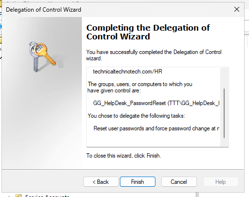
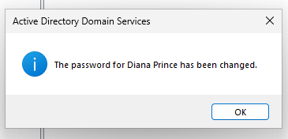
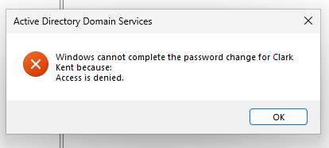
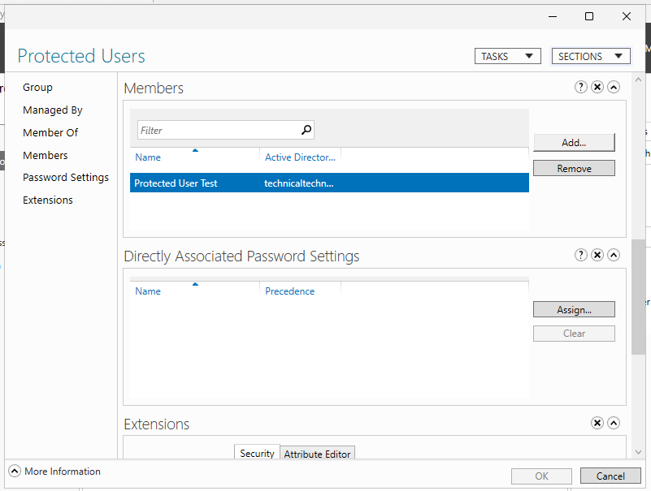
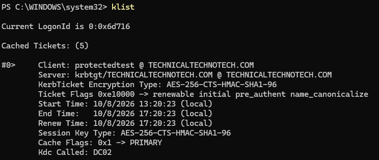
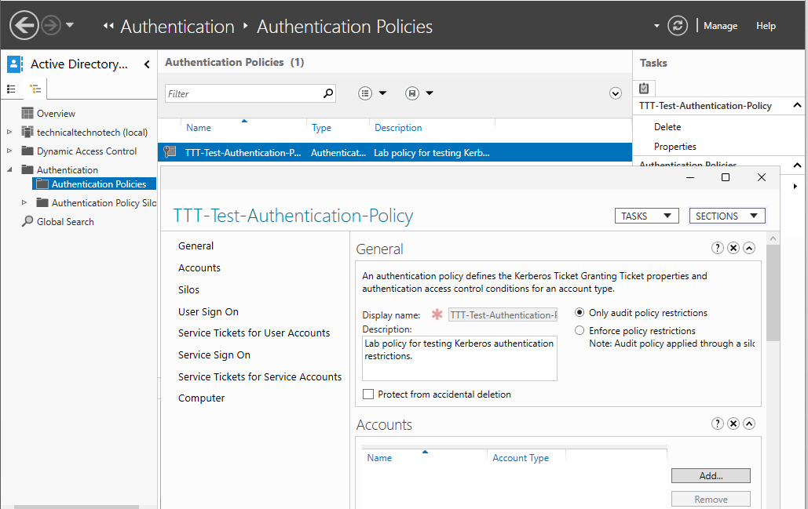
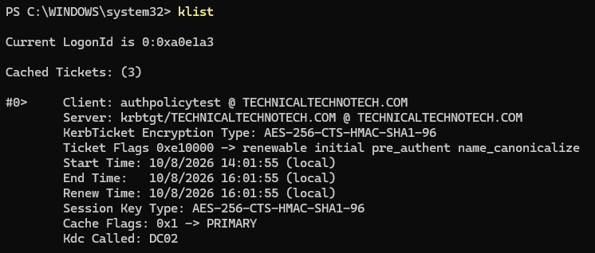

# Active Directory Security – Password Delegation, Protected Users & Authentication Policies

## Project Overview

This project focuses on securing Active Directory Domain Services (AD DS) through delegated administration, privileged account protection, and Kerberos authentication policies.

Using a Windows Server domain environment, I configured and tested security controls designed to limit administrative permissions, protect sensitive accounts, and manage Kerberos ticket lifetimes.

The project demonstrates hands-on experience with Active Directory Administrative Center (ADAC), Active Directory Users and Computers (ADUC), PowerShell, Group Policy concepts, and Kerberos troubleshooting.

---

## Lab Environment

| Component | Configuration |
|---|---|
| Domain | technicaltechnotech.com |
| NetBIOS Name | TTT |
| DC01 | Windows Server Domain Controller |
| DC02 | Windows Server Core Domain Controller |
| MGMT01 | Windows 11 Management Workstation |
| CLIENT01 | Windows 11 Domain-Joined Workstation |
| Management Tools | ADUC, ADAC, PowerShell |
| Authentication | Kerberos |

---

## Password Reset Delegation

### Objective

Allow Help Desk technicians to reset passwords for employees in the HR organizational unit without granting unnecessary administrative privileges.

### Implementation

1. Created a Global Security Group named `GG_HelpDesk_PasswordReset`.
2. Created a standard domain user named `hdtech01`.
3. Added `hdtech01` to the security group.
4. Opened Active Directory Users and Computers.
5. Used the **Delegate Control Wizard** on the HR organizational unit.


 
6. Delegated permission to:
   - Reset user passwords.
   - Force password changes at the next logon.
7. Launched ADUC using the Help Desk test account.


### Validation

- Successfully reset a user password within the HR OU.



- Attempted to reset a user password within the Sales OU.
- Confirmed the operation was denied outside the delegated scope.



### Result

**Successful**

Help Desk permissions were restricted to the designated organizational unit.

This demonstrated the principle of least privilege and role-based administrative delegation.

---

## Project 2 – Protected Users Security Group

### Objective

Explore how the built-in Protected Users security group strengthens authentication security for sensitive Active Directory accounts.

### Implementation

1. Created a standard domain test account named `protectedtest`.
2. Located the built-in **Protected Users** security group.
3. Added the test account to the group.



4. Signed in to CLIENT01 using the protected account.
5. Examined the account's security group membership and Kerberos tickets.

### Verification Commands

Display the current user's security groups:

```powershell
whoami /groups
```

Display Kerberos tickets:

```powershell
klist
```

Verify Active Directory group membership:

```powershell
Get-ADUser protectedtest -Properties MemberOf |
    Select-Object Name,MemberOf
```

### Validation

- Confirmed the test account belonged to the Protected Users group.
- Verified that the account could authenticate to the domain.
- Observed a Kerberos Ticket Granting Ticket (TGT) lifetime of approximately four hours.



### Security Features Studied

Protected Users provides additional authentication protections, including:

- Preventing NTLM authentication for protected domain accounts.
- Restricting the use of weaker Kerberos encryption algorithms.
- Preventing credential delegation.
- Limiting Kerberos TGT lifetime and renewal.

### Result

**Successful**

Confirmed Protected Users membership and observed the shortened Kerberos ticket lifetime.

---

## Project 3 – Kerberos Authentication Policy

### Objective

Create an Active Directory Authentication Policy that limits the Kerberos Ticket Granting Ticket lifetime for a designated user.

### Implementation

1. Opened Active Directory Administrative Center.
2. Navigated to **Authentication → Authentication Policies**.
3. Created an authentication policy named `TTT-Test-Authentication-Policy`.



4. Configured the user TGT lifetime to **120 minutes**.
5. Created a standard test user named `authpolicytest`.
6. Assigned the authentication policy to the test account.

### PowerShell Configuration

Assign the authentication policy:

```powershell
Set-ADUser `
    -Identity authpolicytest `
    -AuthenticationPolicy "TTT-Test-Authentication-Policy"
```

Verify the policy assignment:

```powershell
Get-ADUser authpolicytest `
    -Properties AuthenticationPolicy |
    Format-List Name,AuthenticationPolicy
```

Enable policy enforcement:

```powershell
Set-ADAuthenticationPolicy `
    -Identity "TTT-Test-Authentication-Policy" `
    -Enforce $true
```

### Validation

1. Signed in using the test account.
2. Examined the Kerberos ticket lifetime using `klist`.
3. Verified the authentication policy configuration.
4. Enabled enforcement.
5. Obtained a fresh Kerberos ticket through a new sign-in.
6. Confirmed the TGT lifetime was approximately two hours.

### Result

**Successful**

The test account received a Kerberos TGT with the configured 120-minute lifetime after policy enforcement and fresh authentication.



---

## Security Concepts Demonstrated

### Principle of Least Privilege

Administrative users should receive only the permissions required to perform their responsibilities.

### Delegated Administration

Permissions can be assigned at the organizational unit level without granting Domain Admin privileges.

### Kerberos Authentication

Kerberos uses tickets to authenticate domain users and access network resources.

### Ticket Granting Ticket (TGT)

A TGT allows a user to request service tickets without repeatedly supplying credentials.

### Authentication Policies

Active Directory Authentication Policies provide controls over authentication behavior, including Kerberos TGT lifetime.

### Privileged Account Protection

The Protected Users security group adds restrictions that help reduce exposure to credential theft and misuse.

---

## Troubleshooting and Verification

During the project, I used PowerShell and Windows administrative tools to:

- Verify delegated permissions through successful and denied operations.
- Inspect Active Directory group membership.
- Confirm authentication policy assignments.
- Compare Kerberos ticket lifetimes.
- Verify policy enforcement settings.
- Test authentication behavior using dedicated domain accounts.

These activities reinforced the importance of validating security configurations rather than assuming they work after deployment.

---

## What I Learned

- How to delegate password reset permissions to Help Desk personnel.
- How organizational units limit the scope of delegated administration.
- How Protected Users strengthens authentication security.
- How Kerberos Ticket Granting Tickets work.
- How to inspect Kerberos tickets using `klist`.
- How to create and assign Active Directory Authentication Policies.
- How authentication policy enforcement relates to Kerberos ticket behavior.
- Why dedicated test accounts are important when evaluating security controls.

---

## Skills Practiced

- Active Directory Domain Services (AD DS)
- Active Directory Users and Computers (ADUC)
- Active Directory Administrative Center (ADAC)
- PowerShell Administration
- Organizational Unit Delegation
- Security Group Management
- Role-Based Access Control (RBAC)
- Principle of Least Privilege
- Kerberos Authentication
- Authentication Policy Configuration
- Privileged Account Security
- Identity and Access Management (IAM)
- Security Configuration Testing
- Windows Server Administration
- Technical Troubleshooting
