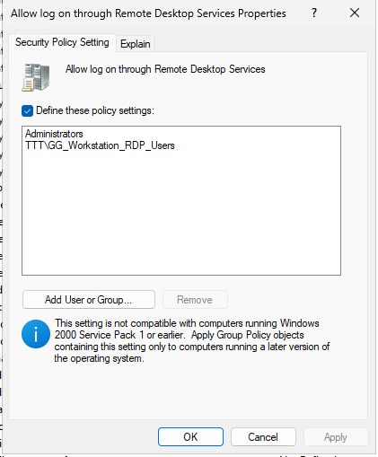
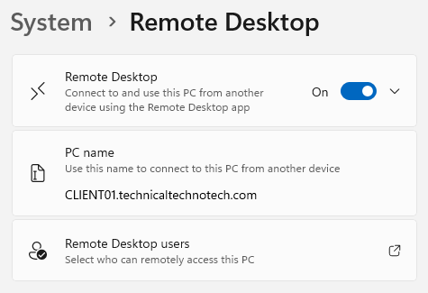
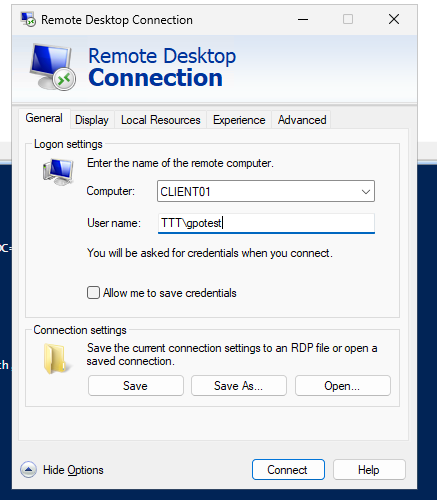
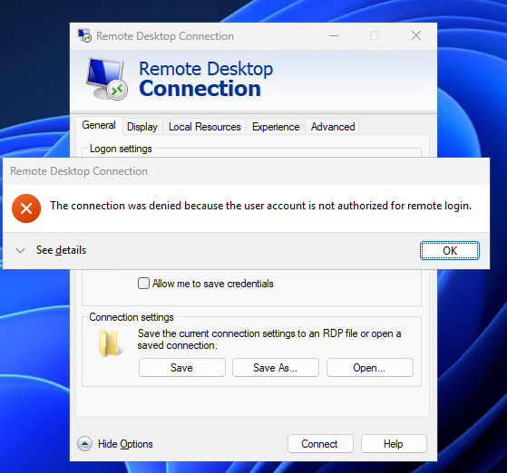
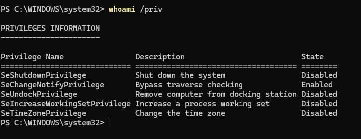
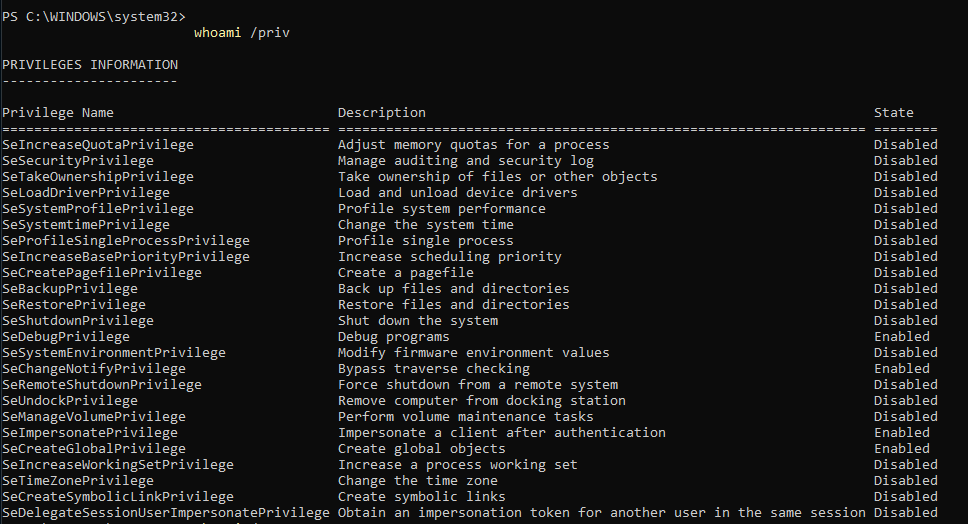
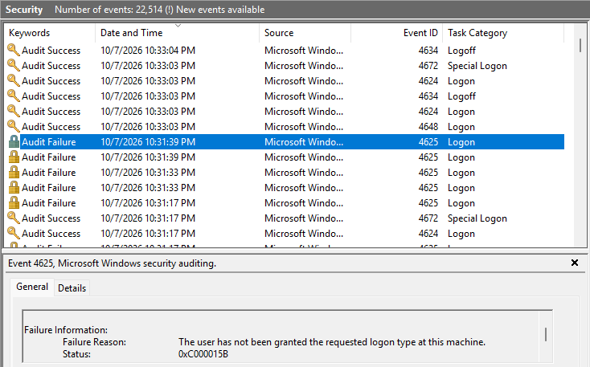

# Windows User Rights Assignment & Security Hardening

## Project Overview

This project focused on managing Windows User Rights Assignment through Active Directory Group Policy to strengthen workstation security and enforce the principle of least privilege.

The lab simulated a business environment where Technical Techno Tech needed to restrict access to company workstations, control Remote Desktop permissions, and manage sensitive operating system privileges.

The project included hands-on configuration, access testing, security token analysis, and Windows event log investigation.

### Project Objectives

- Understand Windows User Rights Assignment
- Differentiate user rights from NTFS permissions
- Configure access restrictions using Group Policy
- Manage Remote Desktop access through security groups
- Demonstrate Allow and Deny logon rights
- Understand how Deny overrides Allow
- Restrict system shutdown privileges
- Analyze Windows security tokens
- Examine high-risk administrative privileges
- Investigate failed logon events
- Apply least-privilege security practices
- Verify effective security configurations

***

# Lab Environment

| System | Role |
|---|---|
| DC01 | Windows Server GUI Domain Controller |
| DC02 | Windows Server Core Domain Controller |
| MGMT01 | Windows 11 Management Workstation |
| CLIENT01 | Windows 11 Domain Client |
| Domain | technicaltechnotech.com |
| NetBIOS | TTT |

### Administrative Tools

- Active Directory Users and Computers (ADUC)
- Group Policy Management Console (GPMC)
- PowerShell
- Command Prompt
- Windows Settings
- Remote Desktop Connection
- Event Viewer
- Group Policy Results

Administration was primarily performed from MGMT01.

CLIENT01 was used as the target workstation for security restrictions and testing.

***

# Understanding User Rights Assignment

## What Is User Rights Assignment?

User Rights Assignment is a Windows security feature that determines which users or groups can perform specific system-level operations.

These rights are different from ordinary file and folder permissions.

### User Rights vs NTFS Permissions

| Security Feature | Purpose |
|---|---|
| NTFS Permissions | Control access to files and folders |
| Security Groups | Organize accounts for access management |
| User Rights Assignment | Control system-level operations and logon capabilities |

A user may have permission to access a shared folder without having permission to sign in to the server hosting that folder.

***

# Accessing User Rights Assignment

On MGMT01, Group Policy Management Console was used to create and configure:

```text
GPO-Lab - User Rights Security
```

The GPO was linked to:

```text
technicaltechnotech.com
└── GPO-Lab
    └── Computers
        └── CLIENT01
```

The settings were accessed under:

```text
Computer Configuration
└── Policies
    └── Windows Settings
        └── Security Settings
            └── Local Policies
                └── User Rights Assignment
```

### Important Concept

User Rights Assignment is located under **Computer Configuration**.

This means the target computer enforces the assigned rights, even when those rights reference domain users and security groups.

***

# Common User Rights Assignment Settings

The following settings were reviewed during the project.

| Setting | Purpose |
|---|---|
| Allow log on locally | Permit interactive local sign-in |
| Deny log on locally | Prevent interactive local sign-in |
| Allow log on through Remote Desktop Services | Permit RDP logon |
| Deny log on through Remote Desktop Services | Prevent RDP logon |
| Access this computer from the network | Permit supported network logon operations |
| Deny access to this computer from the network | Prevent network logon |
| Log on as a service | Permit an account to run a Windows service |
| Log on as a batch job | Permit an account to run batch or scheduled tasks |
| Shut down the system | Permit local system shutdown |
| Force shutdown from a remote system | Permit remote shutdown |
| Back up files and directories | Permit backup operations that can bypass certain file permissions |
| Restore files and directories | Permit privileged file restoration |
| Debug programs | Permit debugging of processes |
| Take ownership of files or other objects | Permit ownership changes |
| Load and unload device drivers | Permit driver-related operations |
| Act as part of the operating system | Grant highly sensitive trusted-computing privileges |

These rights should be assigned based on operational requirements rather than broadly granted to all users.

***

# Restricting Remote Desktop Access

## Business Scenario

Technical Techno Tech wanted only authorized IT personnel to connect remotely to company workstations.

Instead of assigning Remote Desktop permissions directly to individual users, a dedicated Active Directory security group was created.

### Access Design

```text
GG_Workstation_RDP_Users
          |
          v
User Rights Assignment
          |
          v
Allow Log On Through RDS
          |
          v
CLIENT01
```

***

# Creating the RDP Security Group

On MGMT01, PowerShell was used to create a Global Security Group.

```powershell
New-ADGroup `
    -Name "GG_Workstation_RDP_Users" `
    -GroupScope Global `
    -GroupCategory Security `
    -Path "OU=Groups,DC=technicaltechnotech,DC=com"
```

The existing test user was added:

```powershell
Add-ADGroupMember `
    -Identity "GG_Workstation_RDP_Users" `
    -Members "gpotest"
```

Group membership was verified:

```powershell
Get-ADGroupMember "GG_Workstation_RDP_Users"
```

***

# Configuring Allow Log On Through RDS

The following setting was configured in:

```text
GPO-Lab - User Rights Security
```

Policy:

```text
Allow log on through Remote Desktop Services
```

The setting was defined with:

```text
Administrators
TTT\GG_Workstation_RDP_Users
```



### Intended Access

| Principal | RDP Logon Right |
|---|---|
| Administrators | Allowed |
| GG_Workstation_RDP_Users | Allowed |
| Other ordinary users | Not granted by this setting |

Administrators were retained to preserve authorized administrative access.

### Security Principle

> Grant access to security groups rather than managing individual user permissions whenever practical.

This supports centralized administration and reduces repetitive configuration.

***

# Enabling Remote Desktop

Remote Desktop was enabled on CLIENT01 through:

```text
Settings
└── System
    └── Remote Desktop
```

Network Level Authentication (NLA) was left enabled.

NLA requires authentication before establishing a full Remote Desktop session.



***

# Configuring Local Remote Desktop Group Membership

The domain security group was added to CLIENT01's local Remote Desktop Users group.

```powershell
Add-LocalGroupMember `
    -Group "Remote Desktop Users" `
    -Member "TTT\GG_Workstation_RDP_Users"
```

Membership was verified:

```powershell
Get-LocalGroupMember -Group "Remote Desktop Users"
```

### Important Distinction

Allowing Remote Desktop access involves multiple requirements.

| Requirement | Purpose |
|---|---|
| Remote Desktop Enabled | Allows the workstation to accept RDP connections |
| Remote Desktop Users Membership | Provides ordinary users with appropriate local RDP group membership |
| Allow Log On Through RDS | Grants the required Windows logon right |
| Deny Log On Through RDS | Explicitly blocks specified principals |
| Windows Firewall | Must permit the required RDP traffic |

A user must satisfy the applicable requirements before a connection can succeed.

***

# Testing Authorized Remote Desktop Access

From MGMT01, Remote Desktop Connection was launched:

```cmd
mstsc
```

Connection information:

```text
Computer: CLIENT01
Username: TTT\gpotest
```



### Result

The authorized test user successfully connected to CLIENT01 through Remote Desktop.

```text
MGMT01
   |
   | RDP
   v
CLIENT01
   |
   v
GG_Workstation_RDP_Users
   |
   v
ACCESS GRANTED
```

***

# Testing Unauthorized Remote Desktop Access

A second test account was used:

```text
TTT\gpotest2
```

This user was not initially a member of the authorized Remote Desktop security group.

### Result

The unauthorized account was unable to establish the RDP session.

This demonstrated that ordinary domain membership alone does not automatically provide Remote Desktop access.



***

# Remote Desktop Session Behavior

During testing, an additional Windows behavior was observed.

When MGMT01 connected remotely to CLIENT01, the local interactive session on CLIENT01 was locked or disconnected.

When a user signed in locally again, the remote session was disconnected.

This is expected behavior for standard Windows 11 client operating systems, which do not provide the same concurrent multi-user interactive sessions as a properly configured Windows Server Remote Desktop Services deployment.

### What I Observed

```text
MGMT01 connects through RDP
          |
          v
CLIENT01 local session locked/disconnected


Local user signs in again
          |
          v
Remote session disconnected
```

This helped demonstrate the difference between workstation Remote Desktop access and multi-session Remote Desktop Services environments.

***

# Explicit Deny Logon Rights

## Objective

The next exercise demonstrated that an explicit Deny assignment overrides an Allow assignment.

### Important Rule

> Deny overrides Allow.

***

# Creating the Restricted RDP Group

A second security group was created:

```text
GG_Deny_Workstation_RDP
```

PowerShell:

```powershell
New-ADGroup `
    -Name "GG_Deny_Workstation_RDP" `
    -GroupScope Global `
    -GroupCategory Security `
    -Path "OU=Groups,DC=technicaltechnotech,DC=com"
```

The test user was added:

```powershell
Add-ADGroupMember `
    -Identity "GG_Deny_Workstation_RDP" `
    -Members "gpotest2"
```

Verification:

```powershell
Get-ADGroupMember "GG_Deny_Workstation_RDP"
```

***

# Configuring Deny Log On Through RDS

The following User Rights Assignment setting was configured:

```text
Deny log on through Remote Desktop Services
```

The policy included:

```text
TTT\GG_Deny_Workstation_RDP
```

The Deny group was deliberately limited to the test account.

Broad groups such as Domain Users, Authenticated Users, and Administrators were not added.

This avoided unintentionally denying administrative access.


***

# Testing Allow vs Deny

To demonstrate the conflict, `gpotest2` was temporarily added to the authorized RDP group.

```powershell
Add-ADGroupMember `
    -Identity "GG_Workstation_RDP_Users" `
    -Members "gpotest2"
```

The user now belonged to both groups:

```text
                  gpotest2
                  /      \
                 /        \
                v          v
         Allow Group    Deny Group
                \          /
                 \        /
                  v      v
                  CLIENT01
                      |
                      v
                 DENY WINS
```

The computer policy was refreshed:

```cmd
gpupdate /force
```

A new RDP logon was attempted from MGMT01.

### Result

The logon was rejected.

Windows displayed an error equivalent to:

```text
Logon failure:
The user has not been granted the requested
logon type at this computer.
```

This confirmed that the explicit Deny assignment prevented the user from signing in through RDP despite membership in the authorized group.


***

# Cleaning Up the Test Membership

After testing, `gpotest2` was removed from the authorized RDP group.

```powershell
Remove-ADGroupMember `
    -Identity "GG_Workstation_RDP_Users" `
    -Members "gpotest2" `
    -Confirm:$false
```

This restored the intended group membership configuration.

***

# Examining High-Risk Privileges

The next phase focused on sensitive operating system privileges.

The following settings were reviewed:

| Privilege | Security Concern |
|---|---|
| Debug programs | Can allow access to sensitive processes |
| Back up files and directories | Can bypass certain file read restrictions |
| Restore files and directories | Can permit privileged restoration or replacement of files |
| Log on as a service | Allows service logon for designated accounts |
| Log on as a batch job | Allows scheduled or batch task logon |
| Act as part of the operating system | Extremely sensitive operating system privilege |
| Take ownership of files or other objects | Can be used to obtain control over protected objects |
| Load and unload device drivers | Allows sensitive driver operations |

These settings were inspected rather than broadly modified.

The purpose was to understand their security implications and avoid disrupting legitimate Windows operations.

***

# Analyzing Security Tokens

On CLIENT01, the following command was used:

```cmd
whoami /priv
```

This displays privileges associated with the current process security token.



Security group memberships were inspected using:

```cmd
whoami /groups
```

Additional identity information can be displayed using:

```cmd
whoami /all
```

***

# Understanding Security Groups

The `whoami /groups` output contained numerous security groups and security identities.

Examples include:

- Everyone
- Authenticated Users
- Domain Users
- BUILTIN\Users
- BUILTIN\Administrators
- INTERACTIVE

This demonstrated that Windows security tokens contain more than manually assigned Active Directory groups.

Some entries represent logon characteristics, built-in identities, and security context.

### Important Lesson

> Having many security groups in a token does not automatically indicate a security vulnerability.

The security concern is whether the account receives unnecessary privileged access.

***

# Debug Programs Privilege

An elevated administrative session on CLIENT01 showed:

```text
SeDebugPrivilege
```

The privilege was enabled in the observed administrator token.

The same command was then run from a standard user session:

```cmd
whoami /priv
```


### Result

`SeDebugPrivilege` was absent from the standard user's security token.

This demonstrated that the standard user did not receive the sensitive debugging privilege.

### Security Principle

Debug privileges should be restricted to trusted administrative accounts and other explicitly authorized principals.

***

# Restricting Shutdown Privileges

## Business Scenario

Technical Techno Tech wanted to demonstrate how User Rights Assignment could prevent standard users from shutting down a managed workstation.

This was performed as a controlled security-hardening exercise.

Restricting workstation shutdown is not universally recommended for all employee computers, but it may be appropriate in specialized environments such as kiosks or shared-purpose systems.

***

# Configuring Shut Down the System

The existing GPO was edited:

```text
GPO-Lab - User Rights Security
```

Setting:

```text
Shut down the system
```

The policy was defined with:

```text
Administrators
```

The standard Users group was excluded from the configured assignment.

### Intended Result

| Principal | Shutdown Privilege |
|---|---|
| Administrators | Assigned |
| Standard Users | Not assigned |

The separate setting:

```text
Force shutdown from a remote system
```

was not modified.

***

# Applying the Shutdown Policy

On CLIENT01:

```cmd
gpupdate /force
```

Effective computer GPOs were checked:

```cmd
gpresult /scope computer /r
```

The security GPO appeared under the applied Group Policy Objects.

***

# Verifying Shutdown Privileges

The standard test user signed in again to obtain a new logon token.

The following command was executed:

```cmd
whoami /priv
```

### Standard User Result

```text
SeShutdownPrivilege
```

was absent.

The command was then executed from an elevated administrative session.

### Administrator Result

```text
SeShutdownPrivilege
```

was present but displayed as:

```text
Disabled
```

This was an important observation.

***

# Understanding Privilege States

Windows privileges can appear in different states.

| State | Meaning |
|---|---|
| Absent | Privilege is not assigned to the current token |
| Disabled | Privilege is assigned but not currently enabled |
| Enabled | Privilege is assigned and currently enabled |

### Example

```text
STANDARD USER TOKEN

SeShutdownPrivilege
        |
        v
      ABSENT


ADMINISTRATOR TOKEN

SeShutdownPrivilege
        |
        v
     DISABLED
```

The administrator still possesses the privilege even when it is displayed as Disabled.

A process can enable an assigned privilege when required.

### Important Lesson

> Disabled does not mean the privilege has been removed from the computer.

It means the privilege is present in the current token but is not currently enabled.

***

# Security Token Comparison

The test demonstrated how Windows assigns privileges to different security contexts.

```text
User Rights Assignment GPO
            |
            v
     CLIENT01 Security
            |
       New Logon Token
            |
       +----+----+
       |         |
       v         v
    gpotest   Administrator
       |         |
       v         v
    No Shutdown  Shutdown
    Privilege    Privilege
```

This supported the intended least-privilege configuration.

The shutdown restriction was intended as a temporary lab demonstration.

After verification, restoring normal workstation shutdown behavior was recommended by returning the experimental setting to Not Defined, provided no other policy required the restriction.

***

# Security Auditing & Verification

The final phase focused on verifying the effective security configuration and examining Windows security events.

Three main tools were used:

1. `gpresult`
2. `whoami`
3. Event Viewer

***

# Group Policy Verification

The following command was used:

```cmd
gpresult /scope computer /r
```

This confirmed that:

```text
GPO-Lab - User Rights Security
```

was applied to CLIENT01.

A detailed HTML report was generated:

```cmd
gpresult /h C:\UserRightsReport.html
```

The report was used to inspect the effective Group Policy configuration.

Relevant settings included:

```text
Allow log on through Remote Desktop Services

Deny log on through Remote Desktop Services

Shut down the system
```


### Verification Concept

```text
GPO Configured
      |
      v
GPO Applied
      |
      v
Effective Policy
      |
      v
User Rights Enforced
```

Checking the applied GPO alone is not always sufficient.

Actual access and privilege tests provide additional verification.

***

# Windows Security Event Logs

Event Viewer was opened on CLIENT01.

Navigation:

```text
Event Viewer
└── Windows Logs
    └── Security
```

The security log was inspected for logon-related events.

### Relevant Event IDs

| Event ID | Description |
|---|---|
| 4624 | Successful logon |
| 4625 | Failed logon |
| 4672 | Special privileges assigned to a new logon |

***

# Understanding Logon Types

Windows records different logon types depending on how authentication occurs.

| Logon Type | Description |
|---|---|
| 2 | Interactive logon |
| 3 | Network logon |
| 4 | Batch logon |
| 5 | Service logon |
| 7 | Unlock |
| 10 | RemoteInteractive (RDP) |

During the investigation, Logon Types 2 and 7 were observed.

The expected RDP-related Logon Type 10 was not positively identified in the inspected events.

However, a failed logon event contained the same failure reason previously displayed during the RDP restriction test.

### Observed Failure Reason

```text
The user has not been granted the requested
logon type at this computer.
```

This was consistent with the User Rights Assignment restriction.

The specific event was not conclusively correlated to the RDP attempt using its timestamp, account, and status code.

***

# Relevant Logon Failure Status

A commonly associated status code for this type of logon failure is:

```text
0xC000015B
```

Meaning:

```text
The user has not been granted the
requested logon type at this machine.
```

This status is useful when troubleshooting Windows logon rights.

It was reviewed as a diagnostic reference rather than conclusively verified in the captured event.



***

# Security Best Practices

The project reinforced several Windows security principles.

## 1. Principle of Least Privilege

Grant users only the rights required for their responsibilities.

```text
User
  |
  v
Required Permissions Only
```

Avoid granting administrative privileges unnecessarily.

## 2. Use Security Groups

Assign rights to security groups instead of individual users whenever practical.

```text
Users
  |
  v
Security Group
  |
  v
User Rights Assignment
```

This simplifies administration and auditing.

## 3. Restrict Remote Access

Remote Desktop access should be limited to authorized users.

Recommended practices include:

- Use dedicated access groups
- Require Network Level Authentication
- Restrict unnecessary RDP access
- Maintain Windows Firewall protections
- Avoid exposing RDP directly to the public internet
- Review access periodically

## 4. Use Explicit Deny Carefully

Deny assignments override Allow assignments.

Avoid broadly denying:

- Domain Users
- Authenticated Users
- Administrators

without carefully evaluating the consequences.

Incorrect Deny configurations can cause administrative lockouts or service failures.

## 5. Protect High-Risk Privileges

Sensitive privileges should remain restricted to accounts with legitimate operational requirements.

Examples include:

- Debug programs
- Back up files and directories
- Restore files and directories
- Act as part of the operating system
- Take ownership of files or other objects

## 6. Protect Service and Scheduled Task Accounts

Service and batch logon rights should be assigned only when required.

This includes:

```text
Log on as a service
```

and:

```text
Log on as a batch job
```

These rights are different and should not be treated interchangeably.

## 7. Verify Effective Configuration

Do not assume a policy works simply because it was created.

Verify using:

```text
gpresult
whoami
Event Viewer
Actual Access Testing
```

## 8. Avoid Unnecessary Changes to Domain Controllers

Sensitive rights on domain controllers can affect:

- Authentication
- Active Directory services
- Backup operations
- Replication-related services
- Administrative access

For this project, security restrictions were tested primarily on CLIENT01 rather than modifying sensitive domain controller rights.

***

# Troubleshooting Workflow

The following workflow can be used when investigating User Rights Assignment problems.

```text
User Reports Access Problem
            |
            v
Identify Logon Type
            |
            v
Check User Group Membership
            |
            v
whoami /groups
            |
            v
Check Assigned Privileges
            |
            v
whoami /priv
            |
            v
Check Applied Group Policy
            |
            v
gpresult /r
            |
            v
Review Allow / Deny Rights
            |
            v
Check Event Viewer
            |
            v
Identify Cause
            |
            v
Correct Configuration
            |
            v
Retest Access
```

This provides a structured troubleshooting process instead of making random security changes.

***

# Commands Used

## Active Directory Group Management

Create an RDP authorization group:

```powershell
New-ADGroup `
    -Name "GG_Workstation_RDP_Users" `
    -GroupScope Global `
    -GroupCategory Security `
    -Path "OU=Groups,DC=technicaltechnotech,DC=com"
```

Add a user:

```powershell
Add-ADGroupMember `
    -Identity "GG_Workstation_RDP_Users" `
    -Members "gpotest"
```

View membership:

```powershell
Get-ADGroupMember "GG_Workstation_RDP_Users"
```

Remove a test user:

```powershell
Remove-ADGroupMember `
    -Identity "GG_Workstation_RDP_Users" `
    -Members "gpotest2" `
    -Confirm:$false
```

## Local Group Management

Add a domain group to the local RDP group:

```powershell
Add-LocalGroupMember `
    -Group "Remote Desktop Users" `
    -Member "TTT\GG_Workstation_RDP_Users"
```

Verify local membership:

```powershell
Get-LocalGroupMember -Group "Remote Desktop Users"
```

## Group Policy

Refresh Group Policy:

```cmd
gpupdate /force
```

View computer policy:

```cmd
gpresult /scope computer /r
```

Generate HTML report:

```cmd
gpresult /h C:\UserRightsReport.html
```

## Security Token Inspection

View identity:

```cmd
whoami
```

View groups:

```cmd
whoami /groups
```

View privileges:

```cmd
whoami /priv
```

View full security token information:

```cmd
whoami /all
```

## Remote Desktop

Launch Remote Desktop Connection:

```cmd
mstsc
```

***

# What I Learned

Through this project, I learned:

- How Windows User Rights Assignment works
- The difference between User Rights Assignment and NTFS permissions
- How Group Policy centrally manages system-level rights
- Why User Rights Assignment is configured under Computer Configuration
- How to control Remote Desktop logon permissions
- How local Remote Desktop Users membership relates to RDP authorization
- How to use Active Directory security groups for centralized access management
- How Network Level Authentication contributes to RDP security
- How Windows 11 handles interactive local and remote sessions
- How explicit Deny rights override Allow rights
- Why Deny assignments must be configured carefully
- How to restrict system shutdown privileges
- How to compare standard user and administrator security tokens
- How to inspect privileges using whoami /priv
- How to inspect group memberships using whoami /groups
- The difference between absent, disabled, and enabled privileges
- Why a disabled privilege can still be assigned to a security token
- Why many security groups in a token do not automatically indicate a vulnerability
- Why debugging privileges should be restricted
- How backup and restore privileges can bypass ordinary file permissions
- The difference between service and batch logon rights
- How to verify effective security policies with gpresult
- How to investigate failed logons using Event Viewer
- How Windows logon types relate to different authentication methods
- How least privilege improves Windows security
- Why security configurations should be tested before broad deployment

***

# Skills Practiced

- Windows Server Administration
- Active Directory Domain Services
- Group Policy Management
- Group Policy Management Console
- Windows User Rights Assignment
- Windows Security Hardening
- Principle of Least Privilege
- Identity and Access Management
- Role-Based Access Control Concepts
- Active Directory Security Groups
- Global Security Groups
- Remote Desktop Protocol
- Remote Desktop Authorization
- Network Level Authentication
- Windows Security Tokens
- Windows Privileges
- Allow and Deny Logon Rights
- Windows Firewall Awareness
- PowerShell
- Active Directory PowerShell Module
- Get-ADGroupMember
- Add-ADGroupMember
- Remove-ADGroupMember
- Add-LocalGroupMember
- Get-LocalGroupMember
- gpupdate
- gpresult
- whoami
- Event Viewer
- Windows Security Event Analysis
- Security Troubleshooting
- Access Verification
- Technical Documentation
