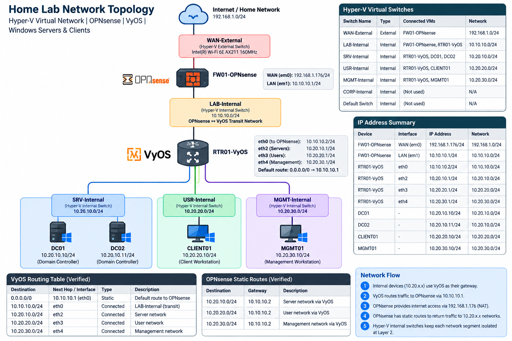

# Windows Server & Active Directory Administration Home Lab

## Overview

Technical Techno Tech is an enterprise-style IT homelab built to develop hands-on experience with **Windows Server, Active Directory, networking, routing, firewalls, PowerShell, Group Policy, security, and IT administration**.

The environment combines Windows infrastructure with virtual and physical-style network components, including **routers, switches, OPNsense, and VyOS**.

> **For reviewers:** Each project folder contains its own `README.md` documenting the scenario, implementation, commands, testing, troubleshooting, screenshots, and lessons learned. Reading the project READMEs provides a complete walkthrough of the work performed.

***

## Core Lab Environment

| System / Technology | Role |
|---|---|
| DC01 | Windows Server Domain Controller |
| DC02 | Windows Server Core Domain Controller |
| MGMT01 | Windows 11 Administrative Workstation |
| CLIENT01 | Windows 11 Domain-Joined Client |
| OPNsense | Firewall / Network Security |
| VyOS | Routing / Network Services |
| Routers | Network Routing |
| Switches | LAN Connectivity / Switching |
| Hyper-V | Virtualization Platform |

**Domain:** `technicaltechnotech.com`

***


## Network Infrastructure

### Overview
Designed and configured a virtual enterprise network using Hyper-V, OPNsense, and VyOS to simulate a segmented corporate environment.

The network supports Active Directory, Windows clients, centralized management, inter-subnet routing, firewall protection, and internet connectivity.

---

### Network Architecture

| Component | Purpose |
|---|---|
| Hyper-V | Virtualization and virtual switching |
| OPNsense | Firewall, outbound NAT, WAN connectivity |
| VyOS | Inter-subnet routing and default gateway |
| DC01 / DC02 | Active Directory Domain Services and DNS |
| CLIENT01 | Windows 11 domain workstation |
| MGMT01 | Administrative management workstation |

### Network Segmentation

| Network | Subnet | Gateway |
|---|---|---|
| Transit | 10.10.10.0/24 | OPNsense: 10.10.10.1 |
| Servers | 10.20.10.0/24 | 10.20.10.1 |
| Clients | 10.20.20.0/24 | 10.20.20.1 |
| Management | 10.20.30.0/24 | 10.20.30.1 |

The three internal subnets use VyOS as their default gateway. VyOS forwards internet-bound traffic to OPNsense.

### Routing and Firewall

- Configured VyOS interfaces for three internal subnets.
- Configured a default route from VyOS to OPNsense.
- Configured OPNsense static routes back to internal networks.
- Implemented Hybrid Outbound NAT for all three internal subnets.
- Connected OPNsense WAN to the external home network through Hyper-V.

### Verification

- Verified Hyper-V virtual switches and VM connections.
- Verified VyOS interfaces and routing table.
- Verified OPNsense static routes and active NAT rules.
- Successfully tested external TCP connectivity from CLIENT01.

### What I Learned

- How virtual switches connect isolated network segments.
- How routers forward traffic between different subnets.
- How firewalls and outbound NAT enable internet connectivity.
- Why return routes are necessary for routed networks.
- How to troubleshoot network connectivity using CLI tools.

### Skills Practiced

- Hyper-V Networking
- Network Segmentation
- IPv4 Addressing and Subnetting
- Static Routing
- Firewall Configuration
- Network Address Translation (NAT)
- Network Troubleshooting
- Infrastructure Verification

---

### Network Topology



***

# Major Projects

## Network Infrastructure, Routing & Firewalls

Built and configured the network infrastructure supporting the Technical Techno Tech environment.

Major areas include:

- Routers and routing
- Ethernet switching
- Network segmentation
- IP addressing and subnetting
- Default gateways
- OPNsense firewall administration
- VyOS routing
- Firewall rules
- Inter-network communication
- Network troubleshooting
- Connectivity verification

This network infrastructure provides the foundation used by the Windows Server and Active Directory environment.

***

## Active Directory Administration

Built and administered a multi-domain-controller Active Directory environment.

Major tasks include:

- User, computer, group, and OU administration
- PowerShell-based AD management
- Delegation of administrative permissions
- Group types and scopes
- Active Directory replication
- Domain controller administration
- FSMO role management

***

## Group-Based Access Control & File Services

Implemented centralized departmental file access using **AGDLP**:

```text
Accounts → Global Groups → Domain Local Groups → Permissions
```

Configured SMB shares and NTFS permissions for departmental resources and performed positive and negative access testing.

***

## Active Directory Automation

Developed PowerShell workflows for:

- CSV-based employee onboarding
- Automated OU placement
- Security group assignment
- Bulk offboarding
- Account management
- Active Directory audit exports

***

## OU Design, Delegation & Group Policy

Designed an OU structure for centralized administration.

Implemented:

- Organizational Unit design
- Delegation of Control
- Least-privilege help desk permissions
- Group Policy deployment
- GPO testing and validation

***

## Active Directory Sites & Network Topology

Connected Active Directory design with the underlying network infrastructure.

Configured and tested:

- AD Sites
- AD subnet mappings
- Domain Controller Locator
- DNS SRV records
- Site-aware domain controller discovery
- Branch-site simulation

***

## Domain Controller Troubleshooting

Diagnosed Active Directory and Windows Server issues using tools including:

```text
dcdiag
repadmin
w32tm
nltest
nslookup
```

Troubleshooting included resolving a PDC Emulator time synchronization problem involving Windows Time and Hyper-V integration.

***

## Backup, Recovery & Disaster Recovery

Implemented and tested Active Directory protection and recovery concepts including:

- Active Directory Recycle Bin
- Deleted-object recovery
- Windows Server Backup
- System State backup
- DSRM
- Non-authoritative and authoritative restore workflows
- FSMO role transfers
- FSMO seizure concepts
- Disaster recovery planning

***

## Group Policy Processing, Scoping & Inheritance

**Status: In Progress**

Current Group Policy lab topics include:

- Starter GPOs
- GPO links
- Security filtering
- WMI filtering
- User vs Computer Configuration
- LSDOU processing
- Link order and precedence
- GPO inheritance
- Block Inheritance
- Enforced policies
- Group Policy troubleshooting

***

# Technologies & Skills

### Windows & Identity

- Windows Server
- Windows Server Core
- Active Directory Domain Services
- Group Policy
- PowerShell
- Windows Admin Center
- RSAT
- FSMO
- Active Directory Sites and Services

### Networking

- Routers
- Switches
- OPNsense
- VyOS
- TCP/IP
- Subnetting
- Routing
- Switching
- Network segmentation
- DNS
- Firewall administration
- Network troubleshooting

### Security & Administration

- Identity and Access Management
- AGDLP
- SMB
- NTFS permissions
- Least privilege
- Delegated administration
- Backup and recovery
- Disaster recovery
- Remote administration

### Virtualization

- Hyper-V
- Virtual machines
- Virtual networking
- Virtual disks

***

# Project Documentation

Each project contains a dedicated `README.md` with the technical details behind the implementation.

The READMEs document:

- Project objectives
- Network or system architecture
- Configuration steps
- Commands used
- Testing and verification
- Troubleshooting
- Screenshots
- What I Learned
- Skills Practiced

> **Recruiters and technical reviewers do not need access to the lab itself. The project READMEs document the implementation from start to finish and provide evidence of the technologies and troubleshooting processes used.**

***

# Current Progression

```text
Network Infrastructure
        ↓
Routing / Switching / Firewalls
        ↓
Windows Server & Active Directory
        ↓
Identity & Access Management
        ↓
PowerShell Automation
        ↓
AD Sites & Replication
        ↓
Troubleshooting
        ↓
Backup & Disaster Recovery
        ↓
Group Policy Processing       ← Current
        ↓
Domain-Based Group Policy     ← Next
```
